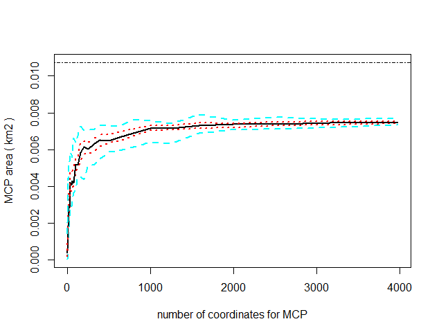

I'm willing to interpret this a bit loosely and say about 500 points are good enough to estimate home range. The birds and periods for which I have at least 500 points are:

* HAR09 - nestling
* HAR10 - nestling
* HAR04 - nestling
* HAR05 - nestling, fledgling
* HAR07 - fledgling

```{r, message=FALSE, warning=FALSE, echo=TRUE}
library('lubridate')
library('tidyverse')
library('sf')
library('adehabitatHR')
library('ggplot2')
library('knitr')

df <- read.csv('../data/processed/telem_all.csv', header=TRUE, stringsAsFactors=FALSE)
```

That's mostly nestling period, so I'll start by taking the nestling season points for those 4 birds and compare the home range sizes for them.

```{r, message=FALSE, echo=TRUE}
# Load in periods from previous notebook.
winter2 <- interval(ymd(20190101), ymd(20190414))
incubation <- interval(ymd(20190415), ymd(20190510))
nestling <- interval(ymd(20190511), ymd(20190710))
fledgling <- interval(ymd(20190711), ymd(20190901))
winter1 <- interval(ymd(20190902), ymd(20191231))

# Do the datetime thing.
df$datetime <- ymd_hms(df$datetime, tz='America/Vancouver')

# Select only the relevant data.
df <- df %>%
  drop_na('lat') %>%
  mutate(yrls=ymd(paste(2019, month(datetime), day(datetime))),
         period=case_when(
           yrls %within% incubation ~ 'incubation',
           yrls %within% nestling ~ 'nestling',
           yrls %within% fledgling ~ 'fledgling',
           yrls %within% winter1 ~ 'winter',
           yrls %within% winter2 ~ 'winter'
         )
  ) %>%
  filter(period == 'nestling') %>%
  filter(id %in% c('HAR10', 'HAR09', 'HAR04', 'HAR05'))

# Do the spatial thing.
sf.df <- st_as_sf(df, coords=c('lon', 'lat')) %>%
  st_set_crs('+proj=longlat +ellps=WGS84 +datum=WGS84 +no_defs') %>%
  st_transform("+proj=utm +zone=10 +datum=WGS84 +units=m +no_defs")

# Calculate MCPs
mcp <- sf.df %>%
  dplyr::select(id, geometry) %>%
  as_Spatial() %>%
  mcp.area(percent=seq(20, 100, by=10),
           unin='m', unout='ha', plotit=FALSE) %>%
  rownames_to_column(var='name') %>%
  mutate(percent=as.numeric(name)) %>%
  dplyr::select(-name)

# Fix formatting so it can actually be graphed.
mcp <- pivot_longer(mcp,
  cols=c('HAR04', 'HAR05', 'HAR09', 'HAR10'), names_to='id')

# Then graph it.
ggplot(mcp, aes(percent, value, color=id)) +
  geom_point() +
  geom_path() +
  theme_classic() +
  theme(panel.grid=element_line(color='white')) +
  labs(x='Percentage location points', y='Home range area (ha)')
```

It's really too bad that the `adehabitat` `mcp()` function requires you to strip away so much info. HAR10 (Mt. Currie) and HAR05 (Ruby Lake) are both female, but while the Currie female obviously has a small home range than the two males, the Ruby Lake female doesn't. Females are expected to have smaller home ranges than males, but that's not apparent from this (admittedly small) sample. But the two Mt. Currie birds (HAR10 and HAR09) do have smaller home ranges than the Ruby Lake and Skaiakos birds, and I do suspected transition zone birds like Currie to have smaller ranges than coastal birds like Ruby Lake and Skaiakos.

So it's very interesting to look at all these lines, but I should also simply put together a table of 90% or 95% MCPs.

```{r, message=FALSE, echo=TRUE}
# Calculate 95% MCPs
mcp.95 <- sf.df %>%
  dplyr::select(id, geometry) %>%
  as_Spatial() %>%
  mcp.area(percent=95,
           unin='m', unout='ha', plotit=FALSE) %>%
  `rownames<-`('95% MCPs (ha)')

# Make a table
kable(mcp.95, format='pandoc', digits=2, caption='2019 nestling season')
```
