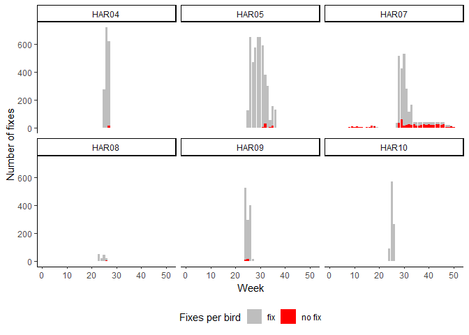
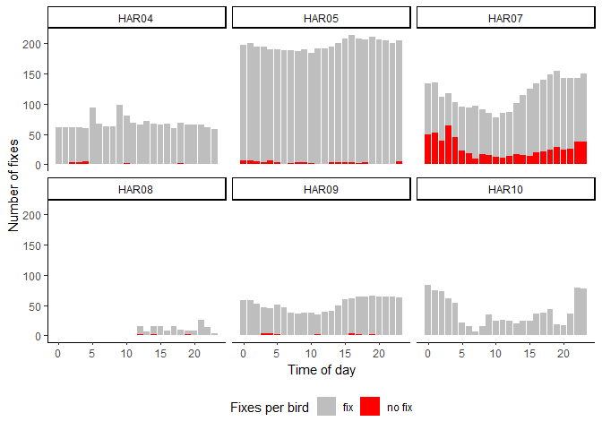

Telemetry data exploration
================

As a preliminary step to doing real science, I want to do some basic exploration of my telemetry data. I'm interested in things like:

-   Number of points/bird/season
-   Step length average/range
-   Turning angle average/range
-   Distribution of points across day and year
-   "Burst" length average/range
-   Number of bursts

``` r
library('lubridate')
library('tidyverse')
library('knitr')

df <- read.csv('../data/processed/telem_all.csv', header=TRUE, stringsAsFactors=FALSE)

# Convert times and dates immediately, just to get it over with.
df$datetime <- ymd_hms(df$datetime, tz='America/Vancouver')
df$date <- date(df$date)

colnames(df)
```

    ##  [1] "id"       "lat"      "lon"      "speed"    "s.time"   "volt"    
    ##  [7] "temp"     "no.fix"   "at.base"  "datetime" "sex"      "site"    
    ## [13] "nest"     "date"     "time"

These telemetry tags were programmed to take a location every 15 minutes. The `no.fix` variable indicates whether there was a successful location fix (0) or not (1).

``` r
df %>%
  select(site, id, no.fix) %>%
  group_by(site, id) %>%
  summarize(total=n(), nofix=sum(no.fix)) %>%
  mutate(fix=total-nofix, p=nofix/total * 100) %>%
  kable(col.names=c('site', 'id', 'total records', 'no fix', 'fix', '% missed'), align='l')
```

| site | id    | total records | no fix | fix  | % missed   |
|:-----|:------|:--------------|:-------|:-----|:-----------|
| MTC  | HAR09 | 1243          | 27     | 1216 | 2.1721641  |
| MTC  | HAR10 | 928           | 5      | 923  | 0.5387931  |
| RLK  | HAR04 | 1617          | 20     | 1597 | 1.2368584  |
| SKA  | HAR05 | 4742          | 71     | 4671 | 1.4972585  |
| TCR  | HAR07 | 2806          | 637    | 2169 | 22.7013542 |
| TCR  | HAR08 | 145           | 10     | 135  | 6.8965517  |

HAR07 was the bird tagged in 2018 whose tag fell off sometime during the winter, which explains the very high (almost 23%) number of missed locations. Because the tags are solar powered, they are likely to miss more points in the winter, when they give up searching for satellites in order to preserve their battery life. It would be interesting to see if this is true.

I'll make a histogram plot for each bird with week on the x axis and number of missed fixes on the y axis.

``` r
df %>%
  mutate(no.fix=as_factor(as.character(no.fix))) %>%
  mutate(week=week(datetime)) %>%
  count(id, week, no.fix) %>%
ggplot(aes(x=week, y=n, fill=no.fix)) +
  geom_bar(position='stack', stat='identity') +
  scale_fill_manual(values=c('gray', 'red'), name='Fixes per bird',
                    labels=c('fix', 'no fix')) +
  labs(y='Number of fixes', x='Week') +
  theme_classic() +
  theme(legend.position='bottom') +
  facet_wrap(~id)
```



There really doesn't seem to be any pattern, though it's hard to tell with such a short time series. What about within a single day?

``` r
df %>%
  mutate(no.fix=as_factor(as.character(no.fix))) %>%
  mutate(hour=hour(datetime)) %>%
  count(id, hour, no.fix) %>%
  ggplot(aes(x=hour, y=n, fill=no.fix)) +
  geom_bar(position='stack', stat='identity') +
  scale_fill_manual(values=c('gray', 'red'), name='Fixes per bird',
                    labels=c('fix', 'no fix')) +
  labs(y='Number of fixes', x='Time of day') +
  theme_classic() +
  theme(legend.position='bottom') +
  facet_wrap(~id)
```



So that doesn't seem to have any real pattern, either.
