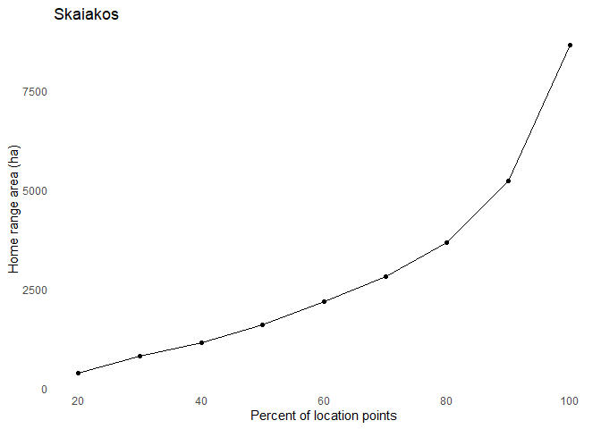
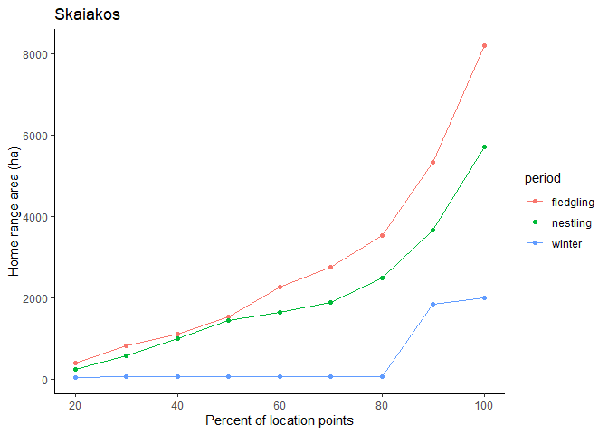

Home Range
================

I've already made some 100%, 90%, and 50% MCPs, but of course MCPs aren't that great and I want to see if I can do better.

Here's some things to look at with particular regard to home range: \* Home range size (MCP) for each bird and each season. This depends on how many points I have, since not all birds have points for each season. \* How many points I need to calculate a MCP (obviously a preliminary for the previous step) \* Plot the birds' home range size relative to each other.

``` r
library('tidyverse')
library('sf')
library('rgdal')
library('adehabitatHR')
library('ggplot2')
library('ggspatial')
library('tibble')
library('lubridate')
library('move')
```

``` r
df <- read.csv('../data/processed/telem_all.csv', header=TRUE, stringsAsFactors=FALSE)

# Separate just the Skaiakos points to work with for now.
ska <- df %>%
  filter(site == 'SKA') %>%
  drop_na('lat')
```

So I can't seem to figure out how to work gracefully with spatial data. I want to make a table showing the area of the different MCPs. First, working with the data as an `sf` object, I have to define the coordinates and the current projection, then transform the data into a different projection I can use to actually measure area, and *then* convert to a spatial data frame to use with the adehabitat package.

``` r
# Make sf object.
sf.ska <- st_as_sf(ska, coords=c('lon', 'lat'))
sf.ska <- st_set_crs(sf.ska, '+proj=longlat +ellps=WGS84 +datum=WGS84 +no_defs')


# Transform to UTM so area makes sense.
sf.ska <- st_transform(sf.ska, "+proj=utm +zone=10 +datum=WGS84 +units=m +no_defs")


# Look at area.
mcp.ska <- sf.ska %>% as_Spatial() %>%
  mcp.area(percent=seq(20, 100, by=10),
           unin='m', unout='ha', plotit=FALSE) %>%
  rownames_to_column(var='name') %>%
  mutate(percent=as.numeric(name)) %>%
  rename(area=a)


ggplot(mcp.ska, aes(percent, area)) +
  geom_point() +
  geom_path() +
  theme_minimal() +
  theme(panel.grid=element_line(color='white')) +
  labs(x='Percent of location points', y='Home range area (ha)', title='Skaiakos')
```



That worked pretty well for all of Skaiakos points, but what about considering the different periods of the annual cycle?

``` r
# Load in periods from previous notebook.
winter2 <- interval(ymd(20190101), ymd(20190414))
incubation <- interval(ymd(20190415), ymd(20190510))
nestling <- interval(ymd(20190511), ymd(20190710))
fledgling <- interval(ymd(20190711), ymd(20190901))
winter1 <- interval(ymd(20190902), ymd(20191231))

# Divide data into periods
sf.ska.per <- sf.ska %>%
  mutate(yrls=ymd(paste(2019, month(datetime), day(datetime))),
         period=case_when(
           yrls %within% incubation ~ 'incubation',
           yrls %within% nestling ~ 'nestling',
           yrls %within% fledgling ~ 'fledgling',
           yrls %within% winter1 ~ 'winter',
           yrls %within% winter2 ~ 'winter'
         )
  ) %>%
  dplyr::select(geometry, period) %>%
  as_Spatial()

# Calculate MCPs
mcp.by.period <- sf.ska.per %>%
  mcp.area(percent=seq(20, 100, by=10),
           unin='m', unout='ha', plotit=FALSE) %>%
  rownames_to_column(var='name') %>%
  mutate(percent=as.numeric(name)) %>%
  dplyr::select(-name)

# Fix formatting so it can actually be graphed.
mcp.by.period <- pivot_longer(mcp.by.period,
  cols=c('fledgling', 'nestling', 'winter'), names_to='period')

# Then graph it.
ggplot(mcp.by.period, aes(percent, value, color=period)) +
  geom_point() +
  geom_path() +
  theme_classic() +
  theme(panel.grid=element_line(color='white')) +
  labs(x='Percent of location points', y='Home range area (ha)', title='Skaiakos')
```



This is really interesting because the fledgling and nestling periods are almost identical for the first 50% of points, and then the fledgling period is larger. This implies that the bird uses the same core area (50%) throughout, but ranges wider during the fledgling period. The problem is that this could just be an artefact of the number of points, since points-wise fledgling &gt; nestling &gt; winter and area-wise fledgling &gt; nestling &gt; winter. Obviously my next step is to see how many points I need to get an accurate MCP.

``` r
ska$datetime <- ymd_hms(ska$datetime, tz='America/Vancouver')
move.ska <- move(x=ska$lon, y=ska$lat, time=ska$datetime, proj=CRS("+proj=longlat"))
hrBootstrap(x=move.ska, rep=25, unin='km', unout='km2', plot=FALSE)
```

    ##                0%          25%          50%          75%         100%
    ## 5    2.910005e-05 0.0001821301 0.0004005108 0.0005672377 0.0009336654
    ## 6    1.394716e-04 0.0003504509 0.0006635047 0.0010965409 0.0022673265
    ## 8    3.374324e-04 0.0006188341 0.0011203909 0.0014943212 0.0036574831
    ## 10   3.861934e-04 0.0011560400 0.0015194526 0.0017563378 0.0027205549
    ## 13   1.106653e-03 0.0020521413 0.0022889464 0.0028084652 0.0036635663
    ## 16   1.392448e-03 0.0022785497 0.0026913475 0.0036970025 0.0048836537
    ## 20   1.646242e-03 0.0022107923 0.0028327566 0.0031014750 0.0043054421
    ## 25   1.345589e-03 0.0025511879 0.0030189797 0.0034885237 0.0043991151
    ## 32   2.392283e-03 0.0033129763 0.0036847354 0.0040709079 0.0047351687
    ## 40   2.262265e-03 0.0036915002 0.0040198838 0.0043979980 0.0055342302
    ## 50   3.413404e-03 0.0037183688 0.0038386660 0.0047060951 0.0053685176
    ## 63   3.117173e-03 0.0037743927 0.0043768541 0.0051479760 0.0060526126
    ## 79   3.540240e-03 0.0043946099 0.0049522471 0.0053759110 0.0064859946
    ## 100  4.293598e-03 0.0049687294 0.0052231017 0.0060638276 0.0073792975
    ## 126  4.408174e-03 0.0045917300 0.0052613091 0.0057713911 0.0063820678
    ## 158  4.155616e-03 0.0048416202 0.0055373190 0.0058455333 0.0072677851
    ## 199  4.835672e-03 0.0054703859 0.0059076441 0.0064210857 0.0072107206
    ## 251  4.998663e-03 0.0057927799 0.0061631922 0.0065389467 0.0071275417
    ## 315  5.462397e-03 0.0057987066 0.0062192183 0.0064921747 0.0069255598
    ## 397  5.686138e-03 0.0063092192 0.0064832466 0.0068938584 0.0072399083
    ## 500  6.041071e-03 0.0066330075 0.0067211763 0.0069455872 0.0072625421
    ## 629  6.116266e-03 0.0065536833 0.0067050577 0.0070616834 0.0072257046
    ## 792  5.808385e-03 0.0065218833 0.0069029689 0.0071111257 0.0076022930
    ## 998  6.473514e-03 0.0068790430 0.0071322317 0.0072870681 0.0075720436
    ## 1256 6.470670e-03 0.0069710346 0.0071695839 0.0073334717 0.0076274636
    ## 1581 6.681484e-03 0.0070999453 0.0072585951 0.0073431984 0.0075586411
    ## 1991 6.815782e-03 0.0072651327 0.0073751030 0.0074495455 0.0077255033
    ## 2506 6.852024e-03 0.0073049492 0.0073803875 0.0074453836 0.0076051952
    ## 3155 7.015397e-03 0.0073853941 0.0075059226 0.0075604983 0.0077834328
    ## 3972 7.208181e-03 0.0073967387 0.0075028352 0.0075394195 0.0076742514

I can't get this to print properly, but it looks depressingly like I need around 750-1000 points to have a really good idea of an MCP. Which may mean that I actually have enough data for Skaiakos to see what I saw above, at least with regards to fledgling and nestling points. But it also means I don't yet have enough data to work with most of birds on a period-by-period basis.
