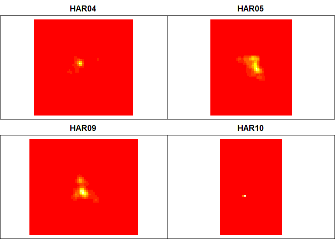
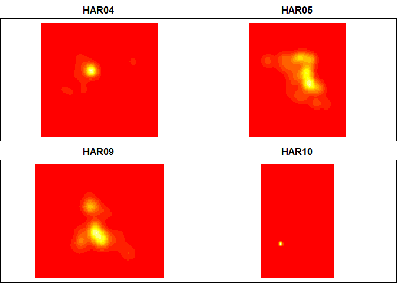
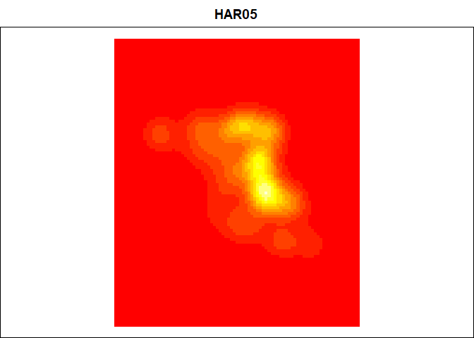
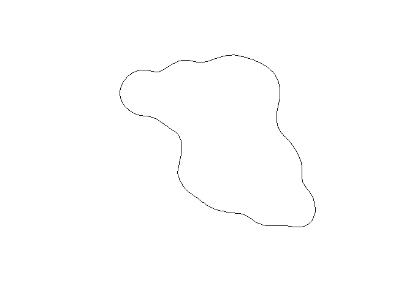
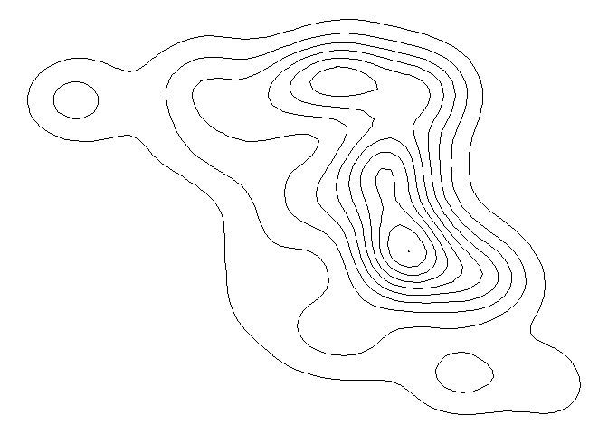

R Notebook
================

So after all that big talk about how MCPs are terrible, of course I went ahead and spent a bunch of time playing around with MCPs. But I now I will *actually* move on to some other estimators, starting with a kernel density estimator.

``` r
# Load up some libraries.
library('tidyverse')
library('lubridate')
library('adehabitatHR')
library('sf')
library('raster')
library('knitr')

# Read in the data.
df <- read.csv('../data/processed/telem_all.csv', 
               header=TRUE, stringsAsFactors=FALSE) %>%
  drop_na('lat')

# Do the datetime thing.
df$datetime <- ymd_hms(df$datetime, tz='America/Vancouver')

# Do the spatial thing.
sf.df <- st_as_sf(df, coords=c('lon', 'lat')) %>%
  st_set_crs('+proj=longlat +ellps=WGS84 +datum=WGS84 +no_defs') %>%
  st_transform("+proj=utm +zone=10 +datum=WGS84 +units=m +no_defs")

# Define period of interest
nestling <- interval(ymd(20190511), ymd(20190710))

# Filter desired period, tags.
sf.df <- sf.df %>%
  mutate(yrls=ymd(paste(2019, month(datetime), day(datetime)))) %>%
  filter(datetime %within% nestling) %>%
  filter(id %in% c('HAR10', 'HAR09', 'HAR04', 'HAR05'))

# Make the kud.
kud <- sf.df %>%
  dplyr::select(id, geometry) %>%
  as_Spatial() %>%
  kernelUD()

image(kud)
```



By Jove, it *worked!!*

I have no idea why the defaults are bright red, but it looks terrible. I think the contour lines look much better. I tried running just `getverticeshr(kud)` but that gave me the error `The grid is too small to allow the estimation of home-range. You should rerun kernelUD with a larger extent parameter`. According to [this StackOverflow post](https://stackoverflow.com/questions/41683905/grid-too-small-for-kernelud-getverticeshr-adehabitathr-home-range-estimation) I should be able to get results with a smaller percent, but when I try to run `getverticeshr(kud, percent=50)` I get a *different* message, which is `Error in re[[i]] : subscript out of bounds`. *Sigh*. If I specify the extent and grid for `kud` then my rasters look nicer:

``` r
kud <- sf.df %>%
  dplyr::select(id, geometry) %>%
  as_Spatial() %>%
  kernelUD(extent=0.25, grid=100)

image(kud)
```

 and I have no trouble plotting the 100% contour lines as long as I don't specifiy the percent (at least, I assume it's showing me 100%). However, it shows me the entire study area with all of the contours, rather than showing tiles as it does for the rasters.

``` r
v.all <- getverticeshr(kud)

plot(v.all)
```


When I take out a single bird to play with, I get the same results, though the contour map is thankfully smaller. Strangely, when I use the default `getverticeshr(kud.ska)` it does return a 100% contour, but when I specify `getverticeshr(kud.ska, percent=100)`, which should come to the same thing, the function returns an error.

``` r
# Select only Skaiakos nestling season data.
sf.ska <- sf.df %>%
  mutate(yrls=ymd(paste(2019, month(datetime), day(datetime)))) %>%
  filter(datetime %within% nestling) %>%
  filter(id == 'HAR05')

# Make the kernel utilization distribution.
kud.ska <- sf.ska %>%
  dplyr::select(id, geometry) %>%
  as_Spatial() %>%
  kernelUD(extent=0.25, grid=100)

# And look at it.
image(kud.ska)
```



There doesn't seem to be an easy, attractive way to visualize multiple contour lines at once using `adehabitat`.

``` r
# This gets me just one contour line, at 95%
getverticeshr(kud.ska, percent=95) %>%
  plot()
```

 I though plotting it in `ggplot` using `geom_contour()` would be the easiest thing, but it turns out I had to do a bunch of conversions to get the `estUD` object into anything I could plot.

``` r
# Convert to a data frame.
kud.ska.df <- raster(as(kud.ska$HAR05,"SpatialPixelsDataFrame")) %>%
  rasterToPoints() %>%
  as.data.frame()

# Graph it.
ggplot(kud.ska.df, aes(x, y, z=ud)) +
  geom_contour(color='black', bins=10) +
  theme_void()
```

 *If* I understand correctly how the ggplot bins and the UD work, setting `bins` to 10 should give me 10% contour lines. One obvious problem with this is that, although it looks pretty and is easy, the `ggplot` contour lines are smoother and more simplified than the `adehabitatHR` lines. So while this is nice to look at, if I want to really be accurate I'll need to actually generate all of the different lines in `adehabitatHR` and then somehow recombine them into a single object.

Then, I'll generate the same 95% home range as I did with the MCP method.

``` r
kud.95 <- kernel.area(kud, percent=95, unin='m', unout='ha') %>%
  as.data.frame %>%
  `rownames<-`('95% KDEs (ha)')

kable(kud.95, format='pandoc', digits=2, caption='2019 nestling season')
```

|                  |      HAR04|    HAR05|       HAR09|                                                                                                              HAR10|
|------------------|----------:|--------:|-----------:|------------------------------------------------------------------------------------------------------------------:|
| 95% KDEs (ha)    |    3873.63|     4731|     2855.65|                                                                                                             102.71|
| They're pretty s |  imilar to|  the MCP|  estimates,|  which I think just indicates that these birds are using a space in a pretty uncomplicated way around their nests.|

### Action items

-   Do a formal comparisons of 95% home range areas generated using KDE and MCP methods
-   Work out contour map method using `adehabitatHR` rather than `ggplot`
-   Run KDE properly with correct smoothing parameters, etc.
