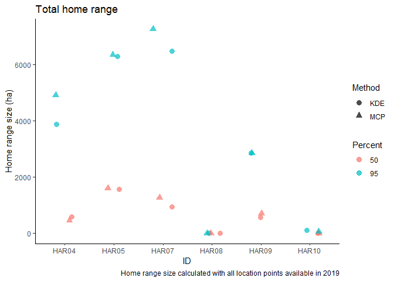
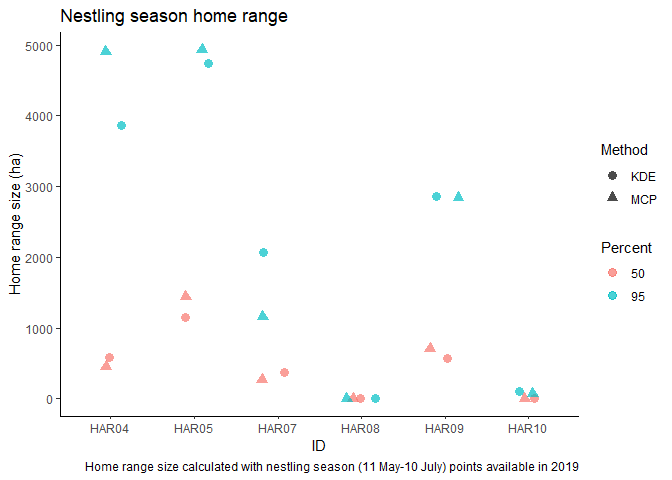

Summary of home range
================

In June of 2018 and 2019, I attached \[^1\] GPS geologgers to 6 northern goshawks in south coastal B.C. Based on dates from the literature, I divided the annual breeding cycle into the four periods (see table).
<table class="table table-condensed" style="width: auto !important; ">
<thead>
<tr>
<th style="text-align:left;">
Period
</th>
<th style="text-align:left;">
Start
</th>
<th style="text-align:left;">
End
</th>
</tr>
</thead>
<tbody>
<tr>
<td style="text-align:left;">
Incubation
</td>
<td style="text-align:left;">
2019-04-15
</td>
<td style="text-align:left;">
2019-05-10
</td>
</tr>
<tr>
<td style="text-align:left;">
Nestling
</td>
<td style="text-align:left;">
2019-05-11
</td>
<td style="text-align:left;">
2019-07-10
</td>
</tr>
<tr>
<td style="text-align:left;">
Fledgling
</td>
<td style="text-align:left;">
2019-07-11
</td>
<td style="text-align:left;">
2019-09-01
</td>
</tr>
<tr>
<td style="text-align:left;">
Winter
</td>
<td style="text-align:left;">
2019-09-02
</td>
<td style="text-align:left;">
2019-04-14
</td>
</tr>
</tbody>
</table>
Using `adehabitatHR`, I calculated 50% and 95% home ranges for all points and for each period of the breeding season, where sufficient location points were available, using both MCP and KDE methods. For the UD estimates, I used the default bandwith, as the least-squares method is not very good for "clumpy" points.
<table class="table" style="margin-left: auto; margin-right: auto;">
<thead>
<tr>
<th style="border-bottom:hidden" colspan="4">
</th>
<th style="border-bottom:hidden; padding-bottom:0; padding-left:3px;padding-right:3px;text-align: center; " colspan="4">
Period

</th>
</tr>
<tr>
<th style="text-align:center;">
ID
</th>
<th style="text-align:center;">
Method
</th>
<th style="text-align:center;">
%
</th>
<th style="text-align:center;">
Total (ha)
</th>
<th style="text-align:center;">
Incubation
</th>
<th style="text-align:center;">
Nestling
</th>
<th style="text-align:center;">
Fledgling
</th>
<th style="text-align:center;">
Winter
</th>
</tr>
</thead>
<tbody>
<tr>
<td style="text-align:center;font-weight: bold;vertical-align: top !important;" rowspan="5">
HAR04
</td>
<td style="text-align:center;vertical-align: top !important;" rowspan="2">
KDE
</td>
<td style="text-align:center;">
50
</td>
<td style="text-align:center;">
580.08
</td>
<td style="text-align:center;">
</td>
<td style="text-align:center;">
579.33
</td>
<td style="text-align:center;">
</td>
<td style="text-align:center;">
</td>
</tr>
<tr>
<td style="text-align:center;">
95
</td>
<td style="text-align:center;">
3873.63
</td>
<td style="text-align:center;">
</td>
<td style="text-align:center;">
3872.00
</td>
<td style="text-align:center;">
</td>
<td style="text-align:center;">
</td>
</tr>
<tr>
<td style="text-align:center;vertical-align: top !important;" rowspan="2">
MCP
</td>
<td style="text-align:center;">
50
</td>
<td style="text-align:center;">
450.90
</td>
<td style="text-align:center;">
</td>
<td style="text-align:center;">
450.90
</td>
<td style="text-align:center;">
</td>
<td style="text-align:center;">
</td>
</tr>
<tr>
<td style="text-align:center;">
95
</td>
<td style="text-align:center;">
4911.07
</td>
<td style="text-align:center;">
</td>
<td style="text-align:center;">
4911.07
</td>
<td style="text-align:center;">
</td>
<td style="text-align:center;">
</td>
</tr>
<tr>
<td style="text-align:center;font-weight: bold;background-color: lightgray !important;">
Number of points
</td>
<td style="text-align:center;font-weight: bold;background-color: lightgray !important;">
</td>
<td style="text-align:center;font-weight: bold;background-color: lightgray !important;">
1597.00
</td>
<td style="text-align:center;font-weight: bold;background-color: lightgray !important;">
0
</td>
<td style="text-align:center;font-weight: bold;background-color: lightgray !important;">
1597.00
</td>
<td style="text-align:center;font-weight: bold;background-color: lightgray !important;">
0.00
</td>
<td style="text-align:center;font-weight: bold;background-color: lightgray !important;">
0.00
</td>
</tr>
<tr>
<td style="text-align:center;font-weight: bold;vertical-align: top !important;" rowspan="5">
HAR05
</td>
<td style="text-align:center;vertical-align: top !important;" rowspan="2">
KDE
</td>
<td style="text-align:center;">
50
</td>
<td style="text-align:center;">
1564.30
</td>
<td style="text-align:center;">
</td>
<td style="text-align:center;">
1150.70
</td>
<td style="text-align:center;">
1641.53
</td>
<td style="text-align:center;">
</td>
</tr>
<tr>
<td style="text-align:center;">
95
</td>
<td style="text-align:center;">
6288.90
</td>
<td style="text-align:center;">
</td>
<td style="text-align:center;">
4736.02
</td>
<td style="text-align:center;">
6499.96
</td>
<td style="text-align:center;">
</td>
</tr>
<tr>
<td style="text-align:center;vertical-align: top !important;" rowspan="2">
MCP
</td>
<td style="text-align:center;">
50
</td>
<td style="text-align:center;">
1604.96
</td>
<td style="text-align:center;">
</td>
<td style="text-align:center;">
1441.18
</td>
<td style="text-align:center;">
1547.09
</td>
<td style="text-align:center;">
69.24
</td>
</tr>
<tr>
<td style="text-align:center;">
95
</td>
<td style="text-align:center;">
6342.45
</td>
<td style="text-align:center;">
</td>
<td style="text-align:center;">
4932.54
</td>
<td style="text-align:center;">
6101.80
</td>
<td style="text-align:center;">
1925.01
</td>
</tr>
<tr>
<td style="text-align:center;font-weight: bold;background-color: lightgray !important;">
Number of points
</td>
<td style="text-align:center;font-weight: bold;background-color: lightgray !important;">
</td>
<td style="text-align:center;font-weight: bold;background-color: lightgray !important;">
4671.00
</td>
<td style="text-align:center;font-weight: bold;background-color: lightgray !important;">
0
</td>
<td style="text-align:center;font-weight: bold;background-color: lightgray !important;">
1396.00
</td>
<td style="text-align:center;font-weight: bold;background-color: lightgray !important;">
3079.00
</td>
<td style="text-align:center;font-weight: bold;background-color: lightgray !important;">
196.00
</td>
</tr>
<tr>
<td style="text-align:center;font-weight: bold;vertical-align: top !important;" rowspan="5">
HAR07
</td>
<td style="text-align:center;vertical-align: top !important;" rowspan="2">
KDE
</td>
<td style="text-align:center;">
50
</td>
<td style="text-align:center;">
933.21
</td>
<td style="text-align:center;">
</td>
<td style="text-align:center;">
370.29
</td>
<td style="text-align:center;">
645.44
</td>
<td style="text-align:center;">
</td>
</tr>
<tr>
<td style="text-align:center;">
95
</td>
<td style="text-align:center;">
6472.01
</td>
<td style="text-align:center;">
</td>
<td style="text-align:center;">
2064.01
</td>
<td style="text-align:center;">
4222.10
</td>
<td style="text-align:center;">
</td>
</tr>
<tr>
<td style="text-align:center;vertical-align: top !important;" rowspan="2">
MCP
</td>
<td style="text-align:center;">
50
</td>
<td style="text-align:center;">
1276.18
</td>
<td style="text-align:center;">
</td>
<td style="text-align:center;">
261.95
</td>
<td style="text-align:center;">
690.32
</td>
<td style="text-align:center;">
2368.20
</td>
</tr>
<tr>
<td style="text-align:center;">
95
</td>
<td style="text-align:center;">
7260.03
</td>
<td style="text-align:center;">
</td>
<td style="text-align:center;">
1158.83
</td>
<td style="text-align:center;">
4435.04
</td>
<td style="text-align:center;">
11938.74
</td>
</tr>
<tr>
<td style="text-align:center;font-weight: bold;background-color: lightgray !important;">
Number of points
</td>
<td style="text-align:center;font-weight: bold;background-color: lightgray !important;">
</td>
<td style="text-align:center;font-weight: bold;background-color: lightgray !important;">
2103.00
</td>
<td style="text-align:center;font-weight: bold;background-color: lightgray !important;">
3
</td>
<td style="text-align:center;font-weight: bold;background-color: lightgray !important;">
210.00
</td>
<td style="text-align:center;font-weight: bold;background-color: lightgray !important;">
1656.00
</td>
<td style="text-align:center;font-weight: bold;background-color: lightgray !important;">
234.00
</td>
</tr>
<tr>
<td style="text-align:center;font-weight: bold;vertical-align: top !important;" rowspan="5">
HAR08
</td>
<td style="text-align:center;vertical-align: top !important;" rowspan="2">
KDE
</td>
<td style="text-align:center;">
50
</td>
<td style="text-align:center;">
0.02
</td>
<td style="text-align:center;">
</td>
<td style="text-align:center;">
0.02
</td>
<td style="text-align:center;">
</td>
<td style="text-align:center;">
</td>
</tr>
<tr>
<td style="text-align:center;">
95
</td>
<td style="text-align:center;">
0.22
</td>
<td style="text-align:center;">
</td>
<td style="text-align:center;">
0.22
</td>
<td style="text-align:center;">
</td>
<td style="text-align:center;">
</td>
</tr>
<tr>
<td style="text-align:center;vertical-align: top !important;" rowspan="2">
MCP
</td>
<td style="text-align:center;">
50
</td>
<td style="text-align:center;">
0.00
</td>
<td style="text-align:center;">
</td>
<td style="text-align:center;">
0.00
</td>
<td style="text-align:center;">
</td>
<td style="text-align:center;">
</td>
</tr>
<tr>
<td style="text-align:center;">
95
</td>
<td style="text-align:center;">
0.15
</td>
<td style="text-align:center;">
</td>
<td style="text-align:center;">
0.15
</td>
<td style="text-align:center;">
</td>
<td style="text-align:center;">
</td>
</tr>
<tr>
<td style="text-align:center;font-weight: bold;background-color: lightgray !important;">
Number of points
</td>
<td style="text-align:center;font-weight: bold;background-color: lightgray !important;">
</td>
<td style="text-align:center;font-weight: bold;background-color: lightgray !important;">
135.00
</td>
<td style="text-align:center;font-weight: bold;background-color: lightgray !important;">
0
</td>
<td style="text-align:center;font-weight: bold;background-color: lightgray !important;">
135.00
</td>
<td style="text-align:center;font-weight: bold;background-color: lightgray !important;">
0.00
</td>
<td style="text-align:center;font-weight: bold;background-color: lightgray !important;">
0.00
</td>
</tr>
<tr>
<td style="text-align:center;font-weight: bold;vertical-align: top !important;" rowspan="5">
HAR09
</td>
<td style="text-align:center;vertical-align: top !important;" rowspan="2">
KDE
</td>
<td style="text-align:center;">
50
</td>
<td style="text-align:center;">
568.32
</td>
<td style="text-align:center;">
</td>
<td style="text-align:center;">
568.19
</td>
<td style="text-align:center;">
</td>
<td style="text-align:center;">
</td>
</tr>
<tr>
<td style="text-align:center;">
95
</td>
<td style="text-align:center;">
2855.65
</td>
<td style="text-align:center;">
</td>
<td style="text-align:center;">
2855.36
</td>
<td style="text-align:center;">
</td>
<td style="text-align:center;">
</td>
</tr>
<tr>
<td style="text-align:center;vertical-align: top !important;" rowspan="2">
MCP
</td>
<td style="text-align:center;">
50
</td>
<td style="text-align:center;">
711.81
</td>
<td style="text-align:center;">
</td>
<td style="text-align:center;">
711.81
</td>
<td style="text-align:center;">
</td>
<td style="text-align:center;">
</td>
</tr>
<tr>
<td style="text-align:center;">
95
</td>
<td style="text-align:center;">
2845.27
</td>
<td style="text-align:center;">
</td>
<td style="text-align:center;">
2845.27
</td>
<td style="text-align:center;">
</td>
<td style="text-align:center;">
</td>
</tr>
<tr>
<td style="text-align:center;font-weight: bold;background-color: lightgray !important;">
Number of points
</td>
<td style="text-align:center;font-weight: bold;background-color: lightgray !important;">
</td>
<td style="text-align:center;font-weight: bold;background-color: lightgray !important;">
1216.00
</td>
<td style="text-align:center;font-weight: bold;background-color: lightgray !important;">
0
</td>
<td style="text-align:center;font-weight: bold;background-color: lightgray !important;">
1216.00
</td>
<td style="text-align:center;font-weight: bold;background-color: lightgray !important;">
0.00
</td>
<td style="text-align:center;font-weight: bold;background-color: lightgray !important;">
0.00
</td>
</tr>
<tr>
<td style="text-align:center;font-weight: bold;vertical-align: top !important;" rowspan="5">
HAR10
</td>
<td style="text-align:center;vertical-align: top !important;" rowspan="2">
KDE
</td>
<td style="text-align:center;">
50
</td>
<td style="text-align:center;">
7.34
</td>
<td style="text-align:center;">
</td>
<td style="text-align:center;">
6.96
</td>
<td style="text-align:center;">
</td>
<td style="text-align:center;">
</td>
</tr>
<tr>
<td style="text-align:center;">
95
</td>
<td style="text-align:center;">
102.71
</td>
<td style="text-align:center;">
</td>
<td style="text-align:center;">
102.95
</td>
<td style="text-align:center;">
</td>
<td style="text-align:center;">
</td>
</tr>
<tr>
<td style="text-align:center;vertical-align: top !important;" rowspan="2">
MCP
</td>
<td style="text-align:center;">
50
</td>
<td style="text-align:center;">
0.68
</td>
<td style="text-align:center;">
</td>
<td style="text-align:center;">
0.68
</td>
<td style="text-align:center;">
</td>
<td style="text-align:center;">
</td>
</tr>
<tr>
<td style="text-align:center;">
95
</td>
<td style="text-align:center;">
67.36
</td>
<td style="text-align:center;">
</td>
<td style="text-align:center;">
67.36
</td>
<td style="text-align:center;">
</td>
<td style="text-align:center;">
</td>
</tr>
<tr>
<td style="text-align:center;font-weight: bold;background-color: lightgray !important;">
Number of points
</td>
<td style="text-align:center;font-weight: bold;background-color: lightgray !important;">
</td>
<td style="text-align:center;font-weight: bold;background-color: lightgray !important;">
923.00
</td>
<td style="text-align:center;font-weight: bold;background-color: lightgray !important;">
0
</td>
<td style="text-align:center;font-weight: bold;background-color: lightgray !important;">
923.00
</td>
<td style="text-align:center;font-weight: bold;background-color: lightgray !important;">
0.00
</td>
<td style="text-align:center;font-weight: bold;background-color: lightgray !important;">
0.00
</td>
</tr>
</tbody>
</table>
This table is missing KDE-method home ranges for those birds with winter points (HAR05 and HAR07). Note the sample size--some estimates are more reliable than others due to rather small numbers of points. Because all birds have some points for the nestling season, I made a summary chart of home range estimates based on all available points and on nestling season points only.  These two graphs are very similar, though the nestling season graph drops the relative size of HAR07's home range. The KDE and MCP estimates are also generally very similar, which is perhaps not surprising in a central-place forager that uses area pretty evenly around its nest. \[^1\]: And by "I" I mean my awesome colleagues and helpers did most of the hard work because they are amazing!
