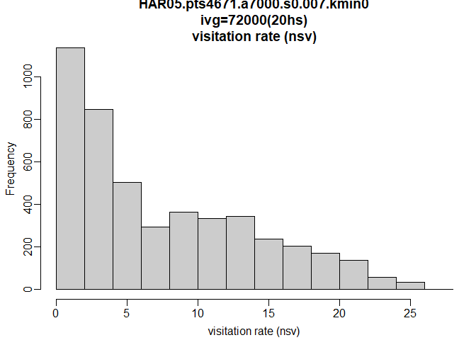
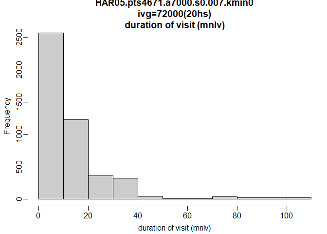
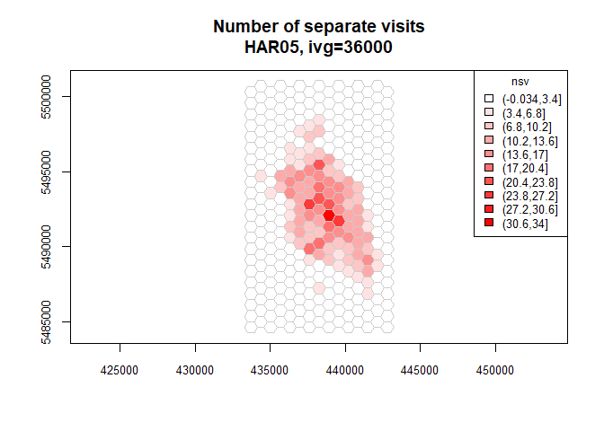
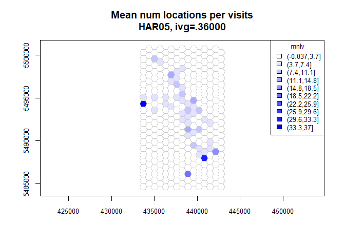
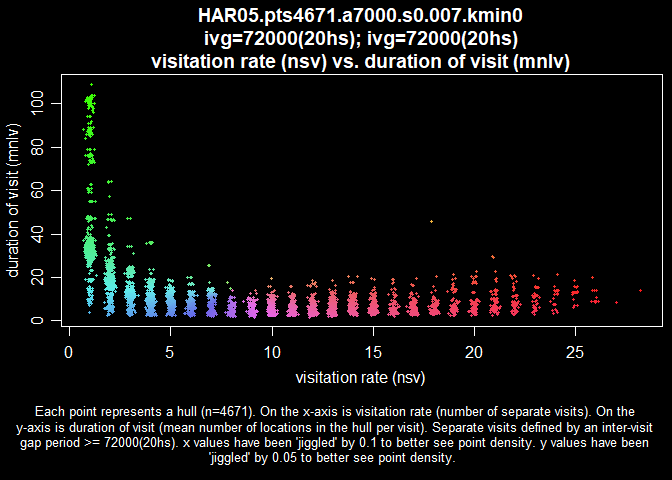
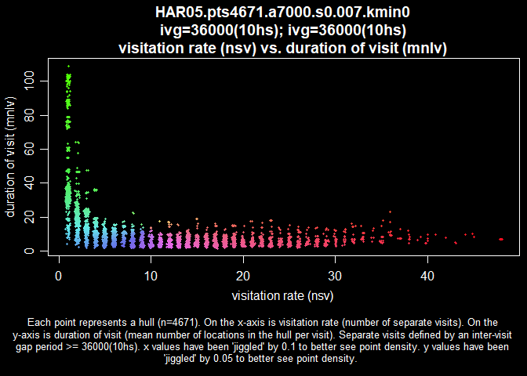
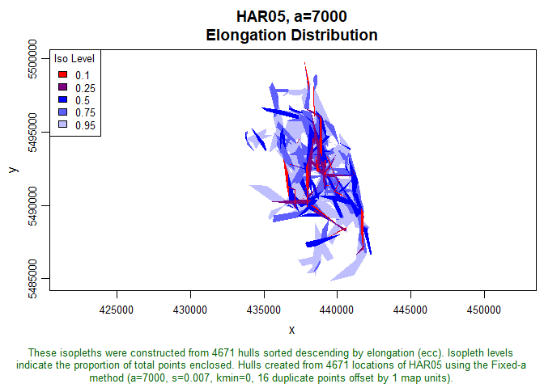

Time and space use
================

I picked a number for *a* that maybe makes sense (*a* = 7000), and have two numbers for *s* that probably make sense (s = 0.007 for 24 hours and *s* = 0.013 for 12 hours (and I think I will need a different *a* value for the 12-hour *s*)).

``` r
# Load some packages.
library('tlocoh') # Requires the FNN package to be installed.
```

    ## Loading required package: sp

    ## T-LoCoH for R (version 1.40.07)
    ## URL: http://tlocoh.r-forge.r-project.org/
    ## Bug reports: tlocoh@gmail.com

``` r
library('tlocoh.dev')
```

    ## Loading required package: shiny

    ## Loading required package: pbapply

    ## tlocoh.dev contains features under development for T-LoCoH
    ## Version 1.34.00
    ## URL: http://tlocoh.r-forge.r-project.org/
    ## Please send bug reports and feedback to tlocoh@gmail.com

``` r
# Load the previous lhs object.
load('../data/processed/har05.n4671.s0.007.a7000.iso.lhs.01.RData')
ska.lhs <- ska.lhs.a7000

load('../data/processed/HAR05.n4671.2019-06-23.2019-09-04.lxy.01.RData')

plot(ska.lhs, iso=T)
```


Looks good. The first and most basic thing to consider is visitation rate (`nsv`), the number of times the bird re-vists the same location. This depends on how far apart a visit needs to be to count as a *separate* visit; the vignette on the T-LoCoh page uses 20 hours, which seems reasonable.

``` r
ska.lhs <- lhs.visit.add(ska.lhs, ivg=3600*20)
hist(ska.lhs, metric='nsv')
```

 Unsurprisingly, a lot of places are only visited once or twice, and also a bunch are visited a handful of times (2-20). Only a few are visited frequently. Duration of visit would also be cool to look at. `mnlv` is the mean length of visit.

``` r
hist(ska.lhs, metric='mnlv')
```

 So most locations are only visited for a very short period of time. It's not clear what the units for the x axis are; seconds don't make much sense, and neither do hours. When I map them, the number of visits unsurprisingly shows a high number of revisits in the core areas, with few revisits on the edges. The duration of visit is less helpful, since it mostly just shows a wash of red short-term visits. It makes me think I have some kind of problem with my parameter values.

``` r
ska.tumap1 <- lxy.tumap(ska.lxy, ivg=10*3600, grid='hex')
plot(ska.tumap1, cex.axis=0.8, cex=0.8, legend='topright')
```

 I think I see why these graphs look so odd. With the inter-visit period set to 10 hours, any all instances at a location within 10 hours are considered a single visit and count toward duration, while instances outside 10 hours are considered a separate visit and count toward number of separate visits. So total time spent in a cell (or hull, or whatever) doesn't really mean anything, because the timer "resets" every 10 hours. The number of locations grid is probably so highly biased by nighttime roosting points that it's not sensitive to slow-moving foraging behavior. And the number of visits grid is so biased by deliveries to the nest it's not sensitive to returns to foraging habitat. Which means that unless I can separate foraging, resting, and delivery behaviors, this method is probably not going to be super helpful for me.

There's just a couple more things to look at before I throw in the towel.

``` r
ska.lhs <- lhs.visit.add(ska.lhs, ivg=3600*10)
hull.scatter <- lhs.plot.scatter(ska.lhs, x='nsv', y='mnlv', col='spiral', bg='black')
```

 Nothing special here. How long the bird stays in a spot is pretty much the same regardless of how often he goes there--he doesn't stay longer in a spot he visits all the time, for example. The excpetion is that some places he doesn't visit very often--in fact, he might only go there a few times--but he spends a long time there when he does go. Again, I expect this is highly biased by roost sites.

``` r
# Add ellipses to hullset.
ska.lhs <- lhs.ellipses.add(ska.lhs)
```

    ## HAR05.pts4671.a7000.s0.007.kmin0
    ##   Calculating enclosing ellipses 
    ## Total time: 7.7 mins

``` r
# Generate isopleths based on eccentricity of ellipses.
ska.lhs <- lhs.iso.add(ska.lhs, sort.metric="ecc")
```

    ## Merging hulls into isopleths
    ## HAR05.pts4671.a7000.s0.007.kmin0
    ##   Sorting hulls by ecc descending...Done. 
    ##   Unioning hulls 
    ## 
      |                                                       
      |                                                 |   0%
      |                                                       
      |++++++++++                                       |  20%
      |                                                       
      |++++++++++++++++++++                             |  40%
      |                                                       
      |+++++++++++++++++++++++++++++                    |  60%
      |                                                       
      |+++++++++++++++++++++++++++++++++++++++          |  80%
      |                                                       
      |+++++++++++++++++++++++++++++++++++++++++++++++++| 100%
    ## Total time: 2.1 secs

``` r
# And plot.
plot(ska.lhs, iso=T, iso.sort.metric="ecc")
```

 Now this is super cool, because there's a lot of red in the middle, where there are also a lot of revisitations, which (unsuprisingly, I guess) implies that while the bird returns to the central area of the nest a lot, he does so while moving in a rapid, directional way--probably making deliveries. The more aimless movement, probably indicating foraging, occurs on the periphery.
