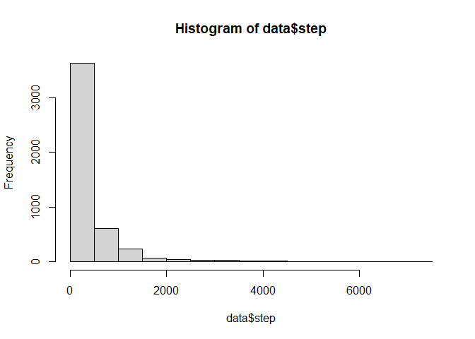
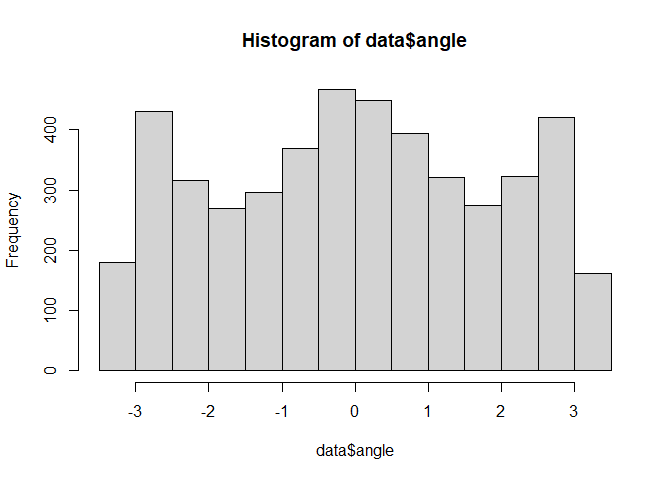

Movement behavior
================

Most NOGO telemetry studies haven’t tried to figure out what the bird is
doing at a given location, and when they have they often haven’t been
very methodical about it. And with good reason\! But that means
space-use studies essentially assume birds use all parts of their
territory in the same way, and that because they are often located near
the nest, they must *use* the area near the nest often. But I think
there’s a chance that the area around the nest is mostly used for
“commuting” as the male brings prey back to the female and then
quickly leaves to continue hunting in more peripheral areas. That means
that in order to figure out where the hunting is atually happening, I
have to differentiate between foraging, resting, and traveling
behaviors.

[A “short” guide to parameter
selection](https://cran.r-project.org/web/packages/moveHMM/vignettes/moveHMM-starting-values.pdf)

``` r
# Load some libraries.
library('tidyverse')
library('lubridate')
library('sp')
library('moveHMM')
library('suncalc')

# Read in the data.
df <- read.csv('../data/processed/telem_all.csv',
               header=TRUE, stringsAsFactors=FALSE) %>%
  drop_na('lat')

# Select just one site to work with.
ska <- df %>% filter(site == 'SKA')

# Convert to sp and specify coordinates.
coordinates(ska) <- c('lon', 'lat')

# Define current projection.
proj4string(ska) <- CRS("+proj=longlat +ellps=WGS84 +datum=WGS84 +no_defs")

# Convert to UTM.
ska <- spTransform(ska, CRS('+proj=utm +zone=10 +datum=WGS84 +units=m +no_defs'))

# Rename from lat/lon to x/y.
colnames(ska@coords) <- c('x', 'y')

# Return to data frame because that's what moveHMM wants.
ska <- as.data.frame(ska)

# Send to moveHMM.
data <- prepData(ska, type="UTM", coordNames=c('x','y'))

# Check it out.
hist(data$step)
```

<!-- -->
Mostly very short step lengths. Apparently a very lazy bird. I can also
look at turning angle.

``` r
hist(data$angle)
```

<!-- -->
Maybe I’m imagining things, but it looks like the bird spends a lot of
time either flying straight (0) or making pretty sharp turns (2.5), but
not making intermediate turns.

The first thing I tried was using the default parameter values from the
vignette, but those didn’t work at all.

``` r
# First, check if there are any steps with a length of 0.
whichzero <- which(data$step==0)
length(whichzero)/nrow(data)
```

    ## [1] 0.0002140869

``` r
# Define parameters.

# Mean step length.
mu0 <- c(250, 750)
# Step length standard deviation. Can start with same as mean.
sigma0 <- c(250, 750)
# Step zero-mass, the proportion of steps = 0.
zeromass0 <- c(0.0002, 0.00001)
# Combine into first parameter.
stepPar0 <- c(mu0,sigma0,zeromass0)

# Mean angle.
angleMean0 <- c(pi, 0)
# Angle concentration.
kappa0 <- c(0.5, 3) 
# Combine into second parameter.
anglePar0 <- c(angleMean0,kappa0)

# Build model.
m <- fitHMM(data=data, nbStates=2, stepPar0=stepPar0, anglePar0=anglePar0,
            formula=~1)
m
```

    ## Value of the maximum log-likelihood: -37617.76 
    ## 
    ## Step length parameters:
    ## ----------------------
    ##                state 1      state 2
    ## mean      4.728378e+01 6.389950e+02
    ## sd        3.412131e+01 6.373572e+02
    ## zero-mass 4.351372e-04 6.343696e-09
    ## 
    ## Turning angle parameters:
    ## ------------------------
    ##                  state 1    state 2
    ## mean          -3.1310919 0.07928592
    ## concentration  0.6905484 0.67605661
    ## 
    ## Regression coeffs for the transition probabilities:
    ## --------------------------------------------------
    ##              1 -> 2    2 -> 1
    ## intercept -2.516172 -2.545082
    ## 
    ## Transition probability matrix:
    ## -----------------------------
    ##            [,1]       [,2]
    ## [1,] 0.92526778 0.07473222
    ## [2,] 0.07275759 0.92724241
    ## 
    ## Initial distribution:
    ## --------------------
    ## [1] 6.447787e-50 1.000000e+00

So this actually seems to have worked. It nicely picked out all of the
roosting sites. The problem is that it lumped everything else together.
So probably a 3-state model is what’s needed.

``` r
# Mean step length.
mu0.3 <- c(5, 250, 1000)
# Step length standard deviation. Can start with same as mean.
sigma0.3 <- c(5, 500, 500)
# Step zero-mass, the proportion of steps = 0.
zeromass0.3 <- c(0.002, 0.0001, 0.00001)
# Combine into first parameter.
stepPar0.3 <- c(mu0.3, sigma0.3, zeromass0.3)

# Mean angle.
angleMean0.3 <- c(pi, pi/2, 0)
# Angle concentration.
kappa0.3 <- c(0.1, 0.5, 3) 
# Combine into second parameter.
anglePar0.3 <- c(angleMean0.3, kappa0.3)

# Fit the model.
m3 <- fitHMM(data=data, nbStates=3, stepPar0=stepPar0.3, anglePar0=anglePar0.3, formula=~1)
```

Well, the 3 state model doesn’t seem to work as well. I’ll try sifting
out the nighttime points first and see if using the daytime points only
works better.

``` r
# Select just one site to work with.
ska <- df %>% filter(site == 'SKA')

# Do the datetime thing.
ska$date <- date(ska$date)
ska$datetime <- ymd_hms(ska$datetime)

# Get sunrise and sunset times.
ska.times <-  getSunlightTimes(data=ska, keep=c('sunrise', 'sunset'), 
                        tz='America/Vancouver')

# Bind to location points.
ska <- left_join(ska, ska.times, by=c('date', 'lat', 'lon'))

# Designate points as day or night.
ska$diff.rise <- as.numeric(difftime(ska$datetime, 
                                     ska$sunrise, units='hours'))
ska$diff.set <- as.numeric(difftime(ska$datetime, 
                                    ska$sunset, units='hours'))

ska$t.period <- case_when(
  ska$diff.rise >= 0 & ska$diff.set <= 0 ~ 'day',
  TRUE ~ 'night'
)

ska <- ska %>% filter(t.period == 'day')

# Convert to sp and specify coordinates.
coordinates(ska) <- c('lon', 'lat')

# Define current projection.
proj4string(ska) <- CRS("+proj=longlat +ellps=WGS84 +datum=WGS84 +no_defs")

# Convert to UTM.
ska <- spTransform(ska, CRS('+proj=utm +zone=10 +datum=WGS84 +units=m +no_defs'))

# Rename from lat/lon to x/y.
colnames(ska@coords) <- c('x', 'y')

# Return to data frame because that's what moveHMM wants.
ska <- as.data.frame(ska)

# Send to moveHMM.
data <- prepData(ska, type="UTM", coordNames=c('x','y'))
```

Now that that’s all done, I’ll try fitting another model.

``` r
# First, check if there are any steps with a length of 0.
whichzero <- which(data$step==0)
length(whichzero)/nrow(data)
```

    ## [1] 0.003044802

``` r
# Mean step length.
mu0 <- c(1000, 2000)
# Also tried: 250 & 750, 500 & 1500

# Step length standard deviation. Can start with same as mean.
sigma0 <- c(1000, 250)
# Also tried: 250 & 250

# Step zero-mass, the proportion of steps = 0.
zeromass0 <- c(0.0004, 0)

# Combine into first parameter.
stepPar0 <- c(mu0, sigma0, zeromass0)

# Mean angle.
angleMean0 <- c(pi, 0)

# Angle concentration.
kappa0 <- c(0.001, 5) 
# Also tried: 0.5 & 3, 0.1 & 5

# Combine into second parameter.
anglePar0 <- c(angleMean0, kappa0)

# Build model.
m <- fitHMM(data=data, nbStates=2, stepPar0=stepPar0, anglePar0=anglePar0,
            formula=~1)
m
```

    ## Value of the maximum log-likelihood: -19341.53 
    ## 
    ## Step length parameters:
    ## ----------------------
    ##                state 1      state 2
    ## mean      48.651496662 7.347273e+02
    ## sd        35.533639100 7.390788e+02
    ## zero-mass  0.007202408 9.997583e-09
    ## 
    ## Turning angle parameters:
    ## ------------------------
    ##                state 1    state 2
    ## mean          3.134259 0.07139032
    ## concentration 0.598128 0.65356250
    ## 
    ## Regression coeffs for the transition probabilities:
    ## --------------------------------------------------
    ##              1 -> 2    2 -> 1
    ## intercept -1.794423 -2.143514
    ## 
    ## Transition probability matrix:
    ## -----------------------------
    ##           [,1]      [,2]
    ## [1,] 0.8574687 0.1425313
    ## [2,] 0.1049389 0.8950611
    ## 
    ## Initial distribution:
    ## --------------------
    ## [1] 0.0001437722 0.9998562278

None of these work. Or rather, even with the night points removed they
still only identify little clusters of points, not larger movements. So
maybe `moveHMM` just isn’t going to work for me.
