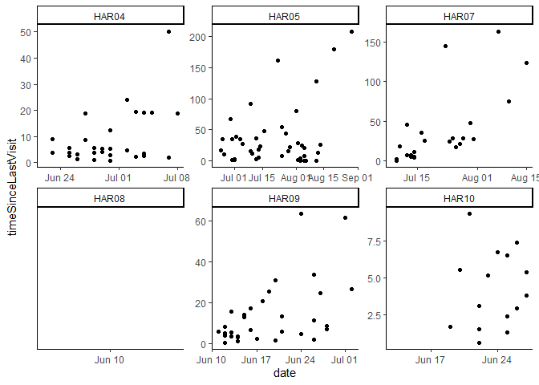
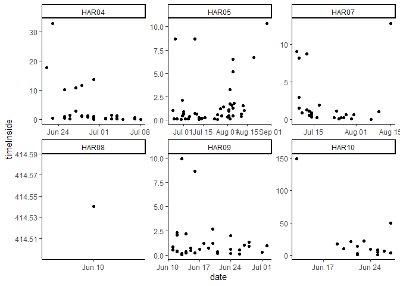
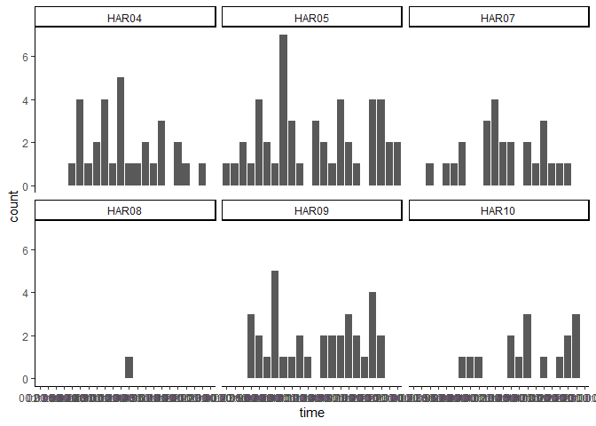

Nest time
================

Let’s take a look at movement behavior around the nest: how much time do
birds spend there, and how often do they come and go.

``` r
# Import conflict settings.
source('../src/conflicted.R')

#Load some libraries.
library(tidyverse)
library(sf)
library(lubridate)
library(adehabitatHR)
library(ggplot2)
library(extrafont)
library(recurse)

# Define some colors.
m <- '#d36135' # Flame
f <- '#689689' # Polished pine

# Load telemetry data.
tl <- read_csv('../data/processed/telemetry_2018-2019.csv')

# RLK appears to have been missexed. I'll change that here.
tl <- tl %>% mutate(sex = case_when(
  id == 'HAR04' ~ 'm',
  TRUE ~ sex
  ))
```

Let’s quickly remind ourselves of what birds we have, and trim down the
points to breeding season only.

``` r
# Define breeding season.
breeding.2018 <- interval(ymd(20180511), ymd(20180901))
breeding.2019 <- interval(ymd(20190511), ymd(20190901))

# Select only points that fall within the breeding season.
tl.breeding <- tl %>% 
  filter(date %within% c(breeding.2018, breeding.2019))

# Summarize.
tl.breeding %>% group_by(id) %>% 
  mutate(min=min(date), max=max(date), n.points=n(), period=max-min) %>% 
  distinct(id, sex, site, n.points, min, max, period) 
```

    ## # A tibble: 6 x 7
    ## # Groups:   id [6]
    ##   id    sex   site  min        max        n.points period 
    ##   <chr> <chr> <chr> <date>     <date>        <int> <drtn> 
    ## 1 HAR10 f     MTC   2019-06-13 2019-06-29      461 16 days
    ## 2 HAR09 m     MTC   2019-06-11 2019-07-02      608 21 days
    ## 3 HAR04 m     RLK   2019-06-22 2019-07-08      799 16 days
    ## 4 HAR05 m     SKA   2019-06-23 2019-09-01     2237 70 days
    ## 5 HAR07 m     TCR   2018-07-08 2018-09-01      933 55 days
    ## 6 HAR08 f     TCR   2019-06-10 2019-06-27       67 17 days

A very simple way of measuring time spent at the nest is to see how many
points are marked as `at.base`. This means the tag was within about 5
meters of the nest (and the base station) when it took the location
point.

``` r
tl.breeding %>% group_by(id) %>% 
  mutate(t.points=n(), base.points=sum(at.base), base.prop=base.points/t.points*100) %>%
  distinct(id, sex, site, base.prop)
```

    ## # A tibble: 6 x 4
    ## # Groups:   id [6]
    ##   id    sex   site  base.prop
    ##   <chr> <chr> <chr>     <dbl>
    ## 1 HAR10 f     MTC       78.1 
    ## 2 HAR09 m     MTC        1.97
    ## 3 HAR04 m     RLK        8.26
    ## 4 HAR05 m     SKA        0   
    ## 5 HAR07 m     TCR        0   
    ## 6 HAR08 f     TCR       86.6

Obviously the males do *visit* the nest since they make prey deliveries,
but equally obviously they don’t linger. Since the tags take locations
every 15 minutes, this means the males generally spend less than 15
minutes at the nest when making a delivery, or stay more than 5 meters
from the nest when making a delivery.

Just to do the thing properly:

``` r
tl.breeding %>% group_by(id) %>% 
  mutate(t.points=n(), base.points=sum(at.base), base.prop=base.points/t.points*100) %>%
  distinct(id, sex, site, base.prop) %>% 
  group_by(sex) %>% mutate(mean.nest.time=mean(base.prop)) %>% 
  distinct(sex, mean.nest.time)
```

    ## # A tibble: 2 x 2
    ## # Groups:   sex [2]
    ##   sex   mean.nest.time
    ##   <chr>          <dbl>
    ## 1 f              82.3 
    ## 2 m               2.56

So males spend an average of 2.5% of their time at the nest, while
females spend an average of 82% of their time at the nest.

Obviously this coarse metric doesn’t tell me about short visits or
close-but-no-cigar visits. For that, let’s try the `recurse` package.

``` r
# Convert data to spatial object.
tl.sf <- tl.breeding %>% st_as_sf(coords=c('lon', 'lat')) %>%
  st_set_crs('+proj=longlat +ellps=WGS84 +datum=WGS84 +no_defs') %>%
  st_transform("+proj=utm +zone=10 +datum=WGS84 +units=m +no_defs")

# Covert back to data frame so recurse can eat it.
tl.c <- tl.sf %>% mutate(xcoord = unlist(map(tl.sf$geometry,1)),
       ycoord = unlist(map(tl.sf$geometry,2))) %>% 
  data.frame() %>% 
  select(xcoord, ycoord, datetime, id)

# Bring in nest coordinates.
nests <- read_csv('../data/processed/telemetry_sites.csv') %>%
  filter(year == 2019) %>% 
  select(x_coord, y_coord) %>% 
  data.frame()

# Calculate revisits.
nest.visits <- getRecursionsAtLocations(tl.c, nests, radius=400)

# Pull out the important stuff.
visit.stats <- nest.visits$revisitStats %>% 
  mutate(time=round_date(entranceTime, unit='hour')) %>% 
  mutate(time=format(time, '%H:%M:%S')) %>% 
  mutate(date=date(entranceTime))

# Look at some summaries.
visit.stats %>% group_by(id) %>%
  summarize(mean=mean(timeSinceLastVisit, na.rm=TRUE),
            min=min(timeSinceLastVisit, na.rm=TRUE),
            max=max(timeSinceLastVisit, na.rm=TRUE))
```

    ## # A tibble: 6 x 4
    ##   id      mean      min     max
    ##   <chr>  <dbl>    <dbl>   <dbl>
    ## 1 HAR04   9.09   0.771    50.3 
    ## 2 HAR05  32.9    0.0671  208.  
    ## 3 HAR07  36.3    0.133   164.  
    ## 4 HAR08 NaN    Inf      -Inf   
    ## 5 HAR09  13.8    0.432    63.5 
    ## 6 HAR10   4.25   0.633     9.38

Looks great… HAR08 looks strange because the bird never leaves the
radius.

Also it’s hard to interpret where these max numbers come from. Was HAR07
really away from the nest for 6 days and then came back? Or does that
number represent when he just… left? And this is showing that the
average time a male spends away from the nest may be around 30 hours,
which seems crazy.

``` r
# Dig into that a bit more.
ggplot(visit.stats, aes(x=date, y=timeSinceLastVisit)) +
  geom_point() +
  theme_classic() +
  facet_wrap(~id, scales='free')
```

<!-- -->

Aha, so that’s interesting–as the chicks get older there’s longer gaps
between nest visits. And of course, after a while the chicks themselves
leave the nest area and start getting fed somewhere else.

Does this hold for time spend inside, too?

``` r
ggplot(visit.stats, aes(x=date, y=timeInside)) +
  geom_point() +
  theme_classic() +
  facet_wrap(~id, scales='free')
```

<!-- -->

Eh, not really. Any patterns to visit timing?

``` r
ggplot(visit.stats, aes(x=time)) +
  geom_histogram(stat='count') +
  theme_classic() +
  facet_wrap(~id)
```

<!-- -->

Nothing there, either. I think that about does it for time spent at the
nest.
