Recurse
================

I started using the `recurse` package in a different notebook but it was
so cool and interesting I decided to break off and make a whole new
notebook just to play with it.

``` r
# Import conflict settings.
source('../src/conflicted.R')

#Load some libraries.
library(tidyverse)
library(sf)
library(lubridate)
library(ggplot2)
library(recurse)
library(move)
library(suncalc)

# Load telemetry data.
tl <- read_csv('../data/processed/telemetry_2018-2019.csv')

# RLK appears to have been missexed. I'll change that here.
tl <- tl %>% mutate(sex = case_when(
  id == 'HAR04' ~ 'm',
  TRUE ~ sex
  ))

# Define breeding season.
breeding.2018 <- interval(ymd(20180511), ymd(20180901))
breeding.2019 <- interval(ymd(20190511), ymd(20190901))

# Select only points that fall within the breeding season.
tl.breeding <- tl %>% 
  filter(date %within% c(breeding.2018, breeding.2019))

# Transform telemetry data to a Move object.
tl.move <- move(x=tl.breeding$lon, y=tl.breeding$lat, time=tl.breeding$datetime,
     proj=CRS('+proj=longlat +ellps=WGS84 +datum=WGS84 +no_defs'),
     data=tl.breeding, animal=tl.breeding$id)

# Convert to UTMs.
tl.move <- spTransform(tl.move, CRSobj='+proj=utm +zone=10 +datum=WGS84 +units=m +no_defs')
```

Some error messages, but hopefully that worked ok.

Now to pop it into the recurse package. The first step in the vignette
is to select the radius. To do that, start by looking at step length. I
can use the `move` package again to calculate distance between points.

``` r
# Calculate step length.
dist <- distance(tl.move)

# Reformat into something useful.
dist <- dist %>% 
lapply(., `length<-`, max(lengths(.))) %>%  ## make all elements as the length of the longest one
  map_df(~.) %>% 
  pivot_longer(cols=everything(), names_to='id', values_to='distance') %>% 
  drop_na()
```

HUGE THANK YOU to [this amazing StackOverflow
question](https://stackoverflow.com/questions/59343647/from-list-to-data-frame-with-tidyverse-selecting-specific-list-elements?noredirect=1&lq=1)
which helped me convert the list of vectors produced by `move` into a
useable data frame.

``` r
# Plot it.
ggplot(dist, aes(y=distance)) +
  geom_histogram(binwidth=10) +
  theme_classic() +
  coord_flip() +
  facet_wrap(~id, scales='free')
```

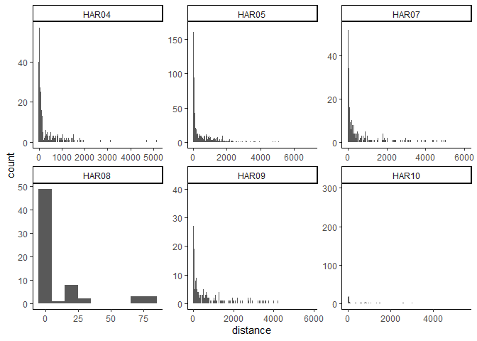<!-- -->

Kind of fascinating. Obviously most steps are less than 2000 m, but
there are some outliers. Let’s clip the range a little to get a better
look.

``` r
dist %>% filter(distance < 2000) %>% 
  ggplot(aes(y=distance)) +
  geom_histogram(binwidth=10) +
  theme_classic() +
  coord_flip() +
  facet_wrap(~id, scales='free')
```

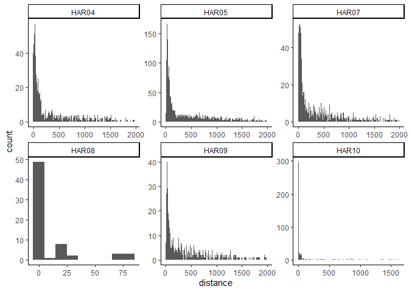<!-- -->

That’s better. Of course, it’s still hard to say what to actually *do*
with this. But let’s go with a radius of 100m, to start with.

But, ummm, after all that I think I really need to just pull one site
out to work with because doing all this code in a nested way is super
annoying. Also, it turns out I don’t like working with move objects. And
I want to filter out nighttime points because they’ll just confuse the
issue right now.

``` r
# Separate out RLK points.
rlk <- filter(tl.breeding, id == 'HAR04')

# Calculate sunrise and sunset.
suntimes <- getSunlightTimes(data=rlk, keep=c('sunrise', 'sunset'), 
                        tz='America/Vancouver')

# Filter out daytime points.
rlk <- left_join(rlk, suntimes, by=c('lat', 'lon', 'date')) %>%
  filter(hour(datetime) > hour(sunrise)) %>%
  filter(hour(datetime) < hour(sunset))

# Make a spatial object and convert to UTMs.
rlk.sf <- rlk %>% st_as_sf(coords=c('lon', 'lat')) %>%
  st_set_crs('+proj=longlat +ellps=WGS84 +datum=WGS84 +no_defs') %>%
  st_transform("+proj=utm +zone=10 +datum=WGS84 +units=m +no_defs")

# Convert back to data frame.
rlk.sf.c <- rlk.sf %>% mutate(xcoord = unlist(map(rlk.sf$geometry,1)),
       ycoord = unlist(map(rlk.sf$geometry,2))) %>% 
  data.frame() %>% 
  select(xcoord, ycoord, datetime, id)

# Calculate revisits.
rlk.visit <- getRecursions(rlk.sf.c, 100)

# And plot them.
plot(rlk.visit, rlk.sf.c, axes=FALSE)
```

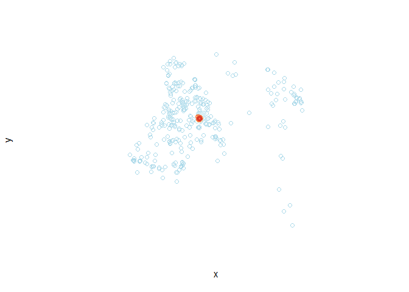<!-- -->

So this basically just shows the nest, which is what I was originally
working on in my first notebook. So I’ll come back to that.

Let’s try some different radii and see what happens.

``` r
rlk.200 <- getRecursions(rlk.sf.c, 200)
plot(rlk.200, rlk.sf.c, axes=FALSE)
```

<!-- -->

``` r
rlk.300 <- getRecursions(rlk.sf.c,300)
plot(rlk.300, rlk.sf.c, axes=FALSE)
```

<!-- -->

``` r
rlk.400 <- getRecursions(rlk.sf.c, 400)
plot(rlk.400, rlk.sf.c, axes=FALSE)
```

<!-- -->

``` r
rlk.500 <- getRecursions(rlk.sf.c, 500)
plot(rlk.500, rlk.sf.c, axes=FALSE)
```

<!-- -->

Still just shows the nest, essentially. So an option when exploring
foraging behavior might be to define a nest area and exclude all points
within that.

Let’s see if clustering throws anything up

``` r
visit.threshold = quantile(rlk.300$revisits, 0.8)
cluster = kmeans(rlk.sf.c[rlk.300$revisits > visit.threshold, c('xcoord', 'ycoord')], centers=3)

plot(rlk.sf.c$xcoord, rlk.sf.c$ycoord,
     pch = '.', axes=FALSE, asp=1)

with(rlk.sf.c[rlk.300$revisits > visit.threshold,],
     points(xcoord, ycoord, pch=c(15:17)[cluster$cluster]))
```

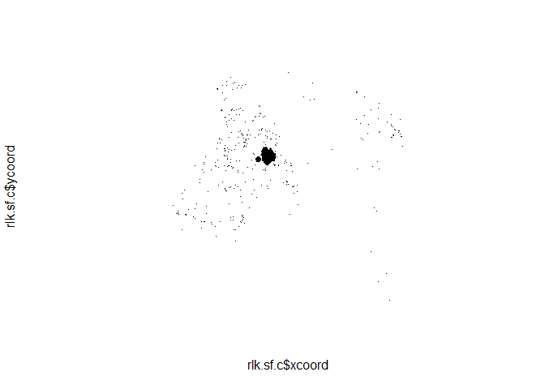<!-- -->

Still just shows the nest area. But maybe this can helpful to define
what the “nest area” should be for exclusion. Of course, I did this
whole cluster analysis with the completely arbitrary radius of 300m,
which is utterly indefensible.

Ok, let’s go back to the step length. First, quickly check time
interval.

``` r
# I broke something when I joined the suntimes, so I'll re-make this.
rlk <- filter(tl.breeding, id == 'HAR04')

# Look at distribution of times.
rlk %>% mutate(n.time=lead(time), d.time=difftime(n.time, time, units='mins')) %>%
  ggplot(aes(x=n.time)) +
  geom_density(fill='lightgrey') +
  theme_classic()
```

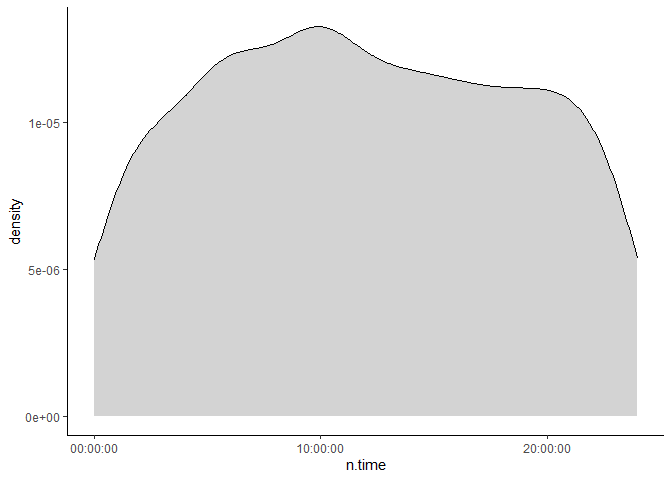<!-- -->

Ok, that’s actually quite pathetic. These are supposed to be taking
points at regular intervals and they’re just… not. And also distanct.

``` r
filter(dist, id == 'HAR04') %>% 
  filter(distance < 1000) %>% 
  ggplot(aes(x=distance)) +
  geom_density(fill='lightgrey') +
  theme_classic()
```

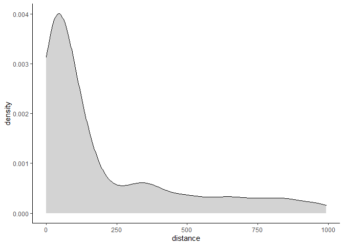<!-- -->

Most steps are less than 250m, though there’s an interesting little hump
around 300. Let’s go with 300 as a “typical” step length, given that
most of the little ones are likely GPS errors incurred while roosting at
night–in other words, when the bird is actually stationary but the GPS
is inaccurate. If that’s that’s the case, then a “missed” nest
visit–when the bird visits the nest but doesn’t take a location at the
nest–could be indicated by a location up to 150m away. So then we can
assume all points within a 150m radius of the nest are actually nest
visits. This gives me an area of 7ha. Alternatively, I could use the
“nest site” of “\< 1ha” from McClaren etal 2015 which gives me the
radius of a mere 56m.

Well, and let’s start with the larger one.

``` r
# Make a buffer around the nests.
nest.buffer <- st_buffer(nests, dist=150)

# Pull out just RLK.
rlk.buffer <- filter(nest.buffer, site == 'RLK' & year == 2019)

# Find the difference with the telemetry points.
rlk.foraging <- st_difference(rlk.sf, rlk.buffer)

# Do the annoying data frame thing again.
rlk.foraging.c <- rlk.foraging %>% mutate(xcoord = unlist(map(rlk.foraging$geometry,1)),
       ycoord = unlist(map(rlk.foraging$geometry,2))) %>% 
  data.frame() %>% 
  select(xcoord, ycoord, datetime, id)

# Calculate revisits, using 150m.
foraging.visits <- getRecursions(rlk.foraging.c, 150)

# And plot.
plot(foraging.visits, rlk.foraging.c, axes=FALSE)
```

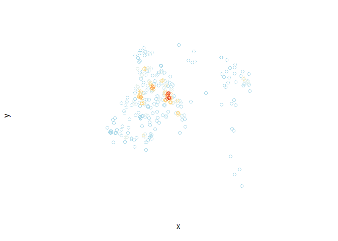<!-- -->

Still heavy on the nest area, but much better. Picks up some other
clusters. Can we look a little closer?

``` r
# Pull out the important stuff.
foraging.stats <- foraging.visits$revisitStats

# Plot it.
foraging.stats %>% drop_na(entranceTime) %>%
  mutate(time=round_date(entranceTime, unit='hour')) %>% 
  mutate(time=format(time, '%H:%M:%S')) %>% 
  ggplot(aes(x=time, y=timeInside)) +
  geom_boxplot() +
  theme_classic() +
  geom_jitter(alpha=0.25) +
  labs(x='entrance time', y='visit duration')
```

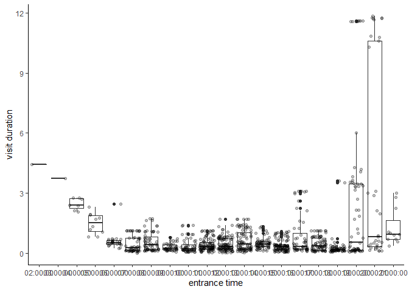<!-- -->

This is depressing on a couple different levels, not the least that all
those late night and early morning points should have been filtered out.
So that obviously didn’t work properly. But there doesn’t seem to be any
real pattern here. If you squint there might be some peaks around 8am,
3pm, and 6pm. This represents lingering–ie, if a goshawk reaches a point
at 3pm, it’s likely to stay close by for longer. Which could represent
foraging activity.

``` r
foraging.stats %>% drop_na(timeSinceLastVisit) %>% 
  ggplot(aes(x=timeSinceLastVisit)) +
  geom_density() +
  theme_classic()
```

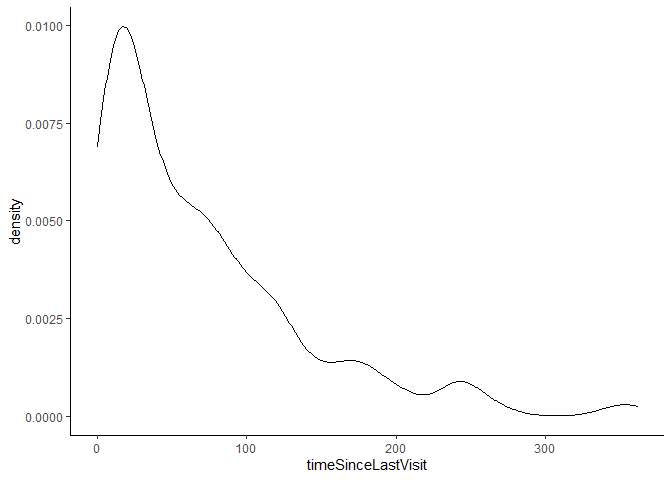<!-- -->

Nothing really pops out here, either. Most spots seem to be revisited
pretty frequently. And this…

``` r
foraging.stats %>% drop_na(timeSinceLastVisit) %>% 
  ggplot(aes(x=timeSinceLastVisit, y=timeInside)) +
  geom_point() +
  theme_classic()
```

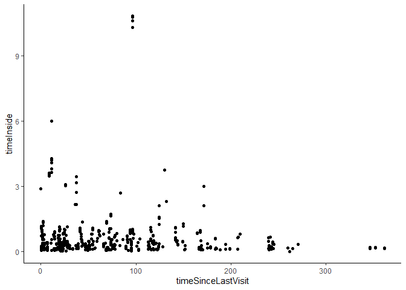<!-- -->

also nothing in particular. (Units in hours, btw.) Certainly there’s a
slight pattern that places visited more frequently are visited for
longer, but it’s not strong.

So I think that’s about all I want to do here, except I’ll take on more
pass at the recursive heatmapping with a larger cut-out. McClaren gives
\< 50ha as the nest area, which gives me 398.9 m (or 400m, good enough)
as a radius.

``` r
# Make a buffer around the nests.
nest.buffer.400 <- st_buffer(nests, dist=400)

# Pull out just RLK.
rlk.buffer.400 <- filter(nest.buffer.400, site == 'RLK' & year == 2019)

# Find the difference with the telemetry points.
rlk.foraging.400 <- st_difference(rlk.sf, rlk.buffer.400)

# Do the annoying data frame thing again.
rlk.foraging.c.400 <- rlk.foraging.400 %>% mutate(xcoord = unlist(map(rlk.foraging.400$geometry,1)),
       ycoord = unlist(map(rlk.foraging.400$geometry,2))) %>% 
  data.frame() %>% 
  select(xcoord, ycoord, datetime, id)

# Calculate revisits, using 150m.
foraging.visits.400 <- getRecursions(rlk.foraging.c.400, 150)

# Make a data frame for ease.
revisits.400 <- data.frame(foraging.visits.400$revisitStats)

# Plot it.
ggplot(revisits.400, aes(x=x, y=y, color=as.factor(visitIdx))) +
  geom_point() +
  scale_color_brewer(palette="RdYlBu", direction=-1) +
  theme_void()
```

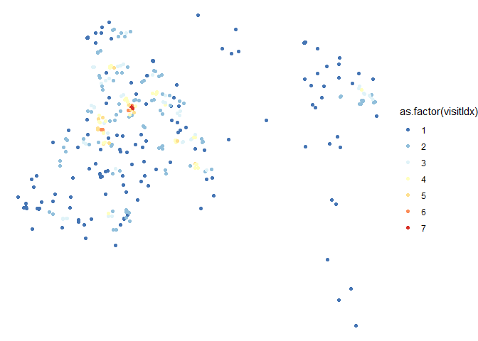<!-- -->

Ah, now we’re talking. So there are definitely some points that get
revisits. I guess the next step is to take all the 4-7s and plug them
into some kind of habitat analysis. But that’s for another day, I think.

Next let’s try looking at return time to a single area.

``` r
# Pull out just the RLK nest coords.
rlk.nest <- read_csv('../data/processed/telemetry_sites.csv') %>% 
  filter(site == 'RLK' & year == 2019) %>% 
  select(x_coord, y_coord) %>% 
  data.frame()
## Note that recuse require this to be a data frame ONLY (no tibbles allowed).

# Calculate revisits.
nest.visits <- getRecursionsAtLocations(rlk.sf.c, rlk.nest, radius=400)

# Pull out the important stuff.
visit.stats <- nest.visits$revisitStats %>% 
  mutate(time=round_date(entranceTime, unit='hour')) %>% 
  mutate(time=format(time, '%H:%M:%S')) %>% 
  mutate(date=date(entranceTime))
```

Lots of really easy things to look at here. How long does the male stay
inside the nest area?

``` r
ggplot(visit.stats, aes(x=timeInside)) +
  geom_density() +
  theme_classic()
```

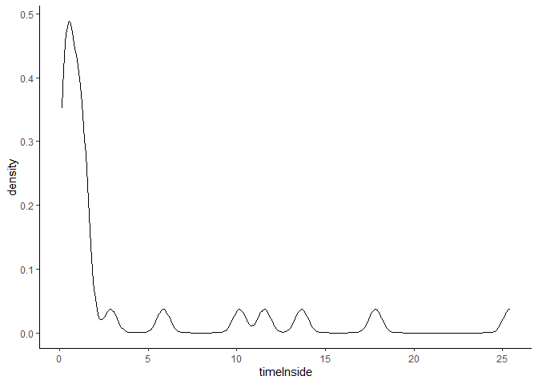<!-- -->

Okay, so this requires a little interpretation because the units are in
hours. So the male is almost always within the nest area for less than 1
hour, but the little bumps indicate when he lingered. So the \~15-25
hour ones are probably when he roosted near the nest (even though I
filtered out the night points, a successive evening and morning point
would look like this).

``` r
ggplot(visit.stats, aes(x=time, y=timeInside)) +
  geom_boxplot() +
  theme_classic() +
  geom_jitter(alpha=0.25) +
  labs(x='entrance time', y='visit duration')
```

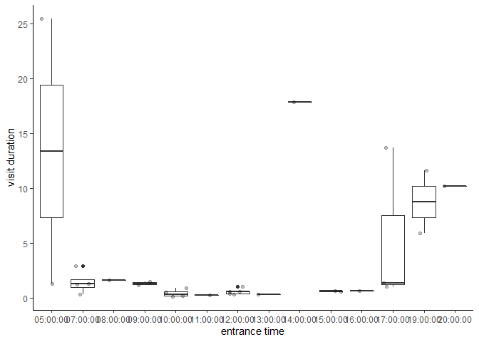<!-- -->

Oh, yeah, all those long visits are nighttime naps.

How about revisit frequency?

``` r
ggplot(visit.stats, aes(x=timeSinceLastVisit)) +
  geom_density() +
  theme_classic()
```

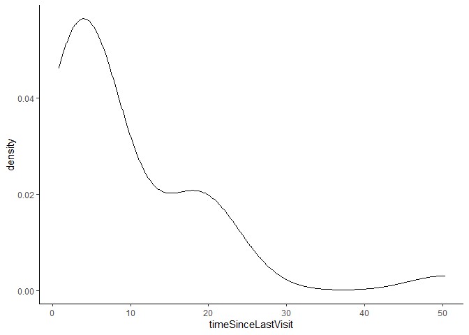<!-- -->

So around five hours between visits (aka deliveries). It will be
interesting to double-check that with the camera data.

And the two together?

``` r
ggplot(visit.stats, aes(x=timeSinceLastVisit, y=timeInside)) +
  geom_point() +
  theme_classic()
```

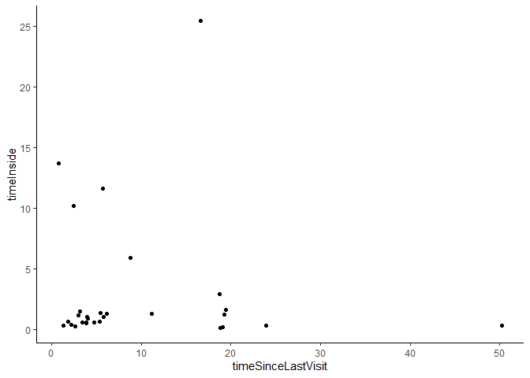<!-- -->

Nothing in particular, though those two outliers are tricky.
