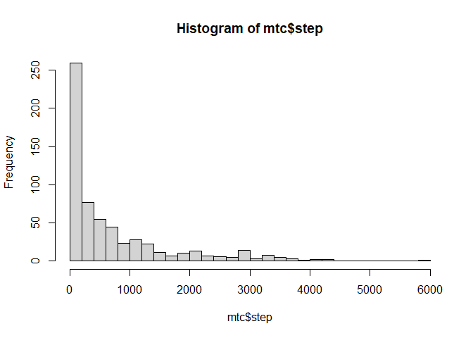
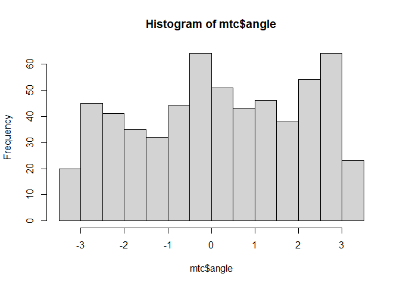
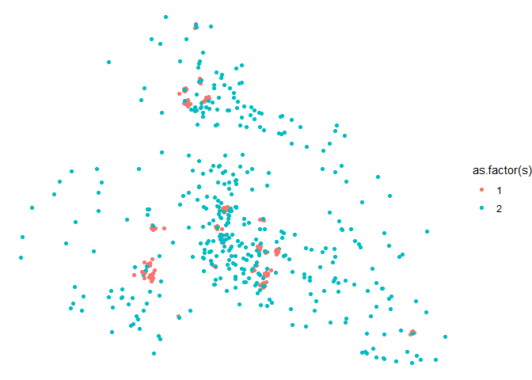
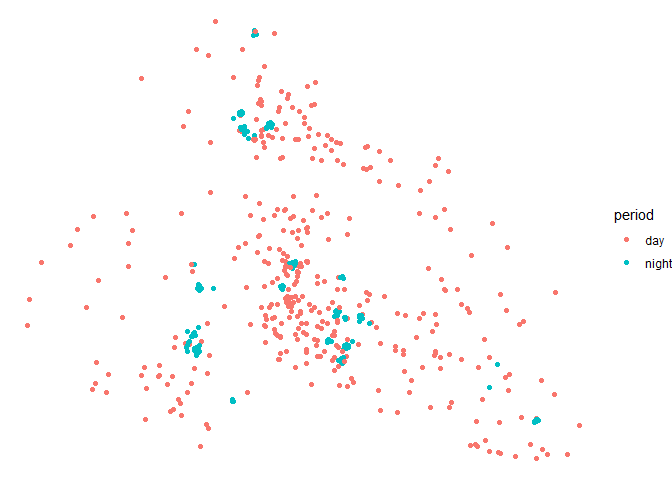

MoveHMM
================

Hidden Markov Models are a method used to classify behavioral states
from movement data. I had trouble with it when I first tried it out, so
I’m giving it another shot and also making a real notebook for it.

``` r
# Import conflict settings.
source('../src/conflicted.R')

#Load some libraries.
library(tidyverse)
library(sf)
library(lubridate)
library(ggplot2)
library(recurse)
library(suncalc)
library(moveHMM)

# Load telemetry data.
tl <- read_csv('../data/processed/telemetry_2018-2019.csv')

# RLK appears to have been missexed. I'll change that here.
tl <- tl %>% mutate(sex = case_when(
  id == 'HAR04' ~ 'm',
  TRUE ~ sex
  ))

# Define breeding season.
# Note that this is an updated period.
breeding.2018 <- interval(ymd(20180410), ymd(20180915))
breeding.2019 <- interval(ymd(20190410), ymd(20190915))

# Select only points that fall within the breeding season.
tl.breeding <- tl %>% 
  filter(date %within% c(breeding.2018, breeding.2019))

# Transform telemetry data to a spatial object and convert to UTMs.
tl.sf <- tl.breeding %>% st_as_sf(coords=c('lon', 'lat')) %>%
  st_set_crs('+proj=longlat +ellps=WGS84 +datum=WGS84 +no_defs') %>%
  st_transform("+proj=utm +zone=10 +datum=WGS84 +units=m +no_defs")

# Convert back to data frame.
tl.sf.c <- tl.sf %>% mutate(xcoord = unlist(map(tl.sf$geometry,1)),
       ycoord = unlist(map(tl.sf$geometry,2))) %>% 
  data.frame() %>% 
  select(xcoord, ycoord, datetime, id)

# Let's pull out one site to play with. This is the MTC male.
mtc <- filter(tl.sf.c, id == 'HAR09')
```

Now that the data is in, let’s prep it with the `moveHMM` package.

``` r
# Calculate step length and whatnot.
mtc <- prepData(mtc, type='UTM', coordNames=c('xcoord', 'ycoord'))
```

And now pick some model parameters for a two-state model. This will
hopefully pick up “resting” and “moving.” Note that I’m using the full
dataset, including nighttime points.

First, pick parameters for step length.

``` r
# Look at the step lengths present in the data.
hist(mtc$step, breaks=24)
```

<!-- -->

For resting, let’s say a mean step length of 100m (this may be too
large) and for movement let’s say 1000m. The default standard deviation
is equal to the mean, so we’ll go with that for now.

``` r
# Define mean step length for each of two states.
step.mean.0 <- c(100, 1000)

# Define step length standard deviation for each of two states.
step.sd.0 <- c(100, 1000)
```

Now do it again with turning angle.

``` r
# Look at the distribution of turning angles present in the data.
hist(mtc$angle)
```

<!-- -->

So kind of interesting. A lot of movement data has a strong central
tendency, ie, a big peak around 0 which indicates that the animal spends
a lot of time moving in the same-ish direction. Obviously goshawks spend
a lot of time turning, since there’s not much peak and quite a lot of
weight on the edges. Hilariously, there seems to be a lot more weight on
the positive side of the graph, which I think indicates this bird is
right-handed–he turns clockwise more often than widdershins.

A conservative starting point for the mean angle is 0, so I’ll go with
that.

``` r
# Define mean turning angle for two states.
angle.mean.0 <- c(0, 0)
```

Then there’s angle concentration, which seems pretty esoteric to me.
There doesn’t seem to be any really helpful information on how to choose
them, except that the state with longer step lengths should have a
larger angle concentration.

``` r
# Define angle concentration for two states.
angle.con.0 <- c(1, 5)

# Finally, we need an estimate of how many step lengths are 0. This is 0.
zero.mass.0 <- c(0,0)

# Combine parameters for step lengths and turning angles.
step.par.0 <- c(step.mean.0, step.sd.0, zero.mass.0)
angle.par.0 <- c(angle.mean.0, angle.con.0)

# Fit the HMM.
mtc.m <- fitHMM(data=mtc, nbStates=2, stepPar0=step.par.0, anglePar0=angle.par.0)
```

Plotting the output of these is v annoying, so I’ll do something really
awkward…

``` r
# Put everything in a data frame.
mtc.s <- data.frame(x=mtc$x,
                    y=mtc$y,
                    s=viterbi(mtc.m))

# Look at it.
ggplot(mtc.s, aes(x=x, y=y, color=as.factor(s))) +
  geom_point() +
  theme_void()
```

<!-- -->

To compare this to how I’ve been doing this so far, let’s do the
day/night thing.

``` r
# Calculate sunrise and sunset.
suntimes <- getSunlightTimes(data=tl, keep=c('sunrise', 'sunset'), 
                        tz='America/Vancouver')

# Mark daytime and nighttime points.
tl.breeding <- left_join(tl.breeding, suntimes, by=c('lat', 'lon', 'date')) %>%
  mutate(period=case_when(
    between(hour(datetime), hour(sunrise), hour(sunset)) ~ 'day',
    TRUE ~ 'night'
  ))

# Plot it.
filter(tl.breeding, id == 'HAR09') %>% 
  right_join(mtc, by=c('datetime', 'id')) %>%
  ggplot(aes(x=x, y=y, color=period)) +
  geom_point() +
  theme_void()
```

<!-- -->

Color is backwards so it’s not the easiest thing to see, but sure enough
the graphs seem to be about the same. Which means I can use super fancy
hidden markov models to work out what I can just as easily figure out
with a timestamp. Super helpful.

So let’s try to do something a little more complicated:a three-state
model. We’ll start by looking at the distribution of turning angles and
such in this simple model, which will hopefully point to how to
parameterize the more complicated model.

``` r
mtc.m
```

    ## Value of the maximum log-likelihood: -5391.302 
    ## 
    ## Step length parameters:
    ## ----------------------
    ##                state 1      state 2
    ## mean      4.692202e+01 1.035821e+03
    ## sd        3.494120e+01 9.874146e+02
    ## zero-mass 2.614278e-10 9.805045e-03
    ## 
    ## Turning angle parameters:
    ## ------------------------
    ##                 state 1   state 2
    ## mean          3.0283788 0.4598988
    ## concentration 0.6468134 0.2246205
    ## 
    ## Regression coeffs for the transition probabilities:
    ## --------------------------------------------------
    ##              1 -> 2    2 -> 1
    ## intercept -1.907164 -2.737695
    ## 
    ## Transition probability matrix:
    ## -----------------------------
    ##            [,1]      [,2]
    ## [1,] 0.87070025 0.1292998
    ## [2,] 0.06078534 0.9392147
    ## 
    ## Initial distribution:
    ## --------------------
    ## [1] 1 0

State 1 (resting) seems pretty accurate, so I can keep those numbers
(47m for mean step length, 35m for step length sd, 0 again for
zero-mass, 3 for mean turning angle, and concentration of 0.65).

State 2 and the new state 3 are a bit trickier. If we’re saying travel
vs foraging… foraging should have shorter step lengths than travel,
that’s easy enough. But the tricky part is turning angles. Because a
travel point could be marked by a very low angle (ie moving straight) or
the exact opposite, a very sharp angle as the bird turns and heads away
from (or towards) the nest.

``` r
# Define mean step length.
step.mean.0.3 <- c(47, 500, 1000)

# Define step length standard deviation.
step.sd.0.3 <- c(35, 500, 1000)

# Define zero mass.
zero.mass.0.3 <- c(0, 0, 0)

# Define mean turning angle.
angle.mean.0.3 <- c(3, 0, 0)

# Define angle concentration.
angle.con.0.3 <- c(0.65, 0.5, 1)

# Combine them.
step.par.0.3 <- c(step.mean.0.3, step.sd.0.3, zero.mass.0.3)
angle.par.0.3 <- c(angle.mean.0.3, angle.con.0.3)

# Make the three-state model.
mtc.t <- fitHMM(data=mtc, nbStates=3, stepPar0=step.par.0.3, anglePar0=angle.par.0.3)

# Look at it.
mtc.t
```

    ## Value of the maximum log-likelihood: -5352.323 
    ## 
    ## Step length parameters:
    ## ----------------------
    ##                state 1      state 2      state 3
    ## mean      4.469038e+01 4.473635e+02 1.615345e+03
    ## sd        3.260821e+01 3.717171e+02 1.151360e+03
    ## zero-mass 1.232628e-08 1.182066e-09 1.938171e-02
    ## 
    ## Turning angle parameters:
    ## ------------------------
    ##                state 1   state 2   state 3
    ## mean          3.015515 0.1014853 2.6416383
    ## concentration 0.675904 0.6656027 0.2601177
    ## 
    ## Regression coeffs for the transition probabilities:
    ## --------------------------------------------------
    ##              1 -> 2  1 -> 3    2 -> 1    2 -> 3    3 -> 1    3 -> 2
    ## intercept -2.509704 -2.6506 -2.048803 -1.596983 -3.348636 -1.494177
    ## 
    ## Transition probability matrix:
    ## -----------------------------
    ##            [,1]       [,2]       [,3]
    ## [1,] 0.86813008 0.07057228 0.06129764
    ## [2,] 0.09680747 0.75109154 0.15210098
    ## [3,] 0.02789234 0.17818310 0.79392455
    ## 
    ## Initial distribution:
    ## --------------------
    ## [1] 2.353633e-12 1.000000e+00 2.460222e-16

Looks like it’s still doing great on the roosting points, still. Some of
the foraging points look good, but it seems to be categorizing a lot of
loitering near the nest as foraging, which seems unlikely. There’s also
a lot of sharp go-and-come-back points that may be a quick, successful
foraging bout but are being classified as travel.

I can run a bunch of different possible values, to deal with some of
these issues. To simplify, I’ll strip out the nighttime points so it’s
back to being a two-state models with (supposedly) foraging and travel,
but no resting.

That means I need to think of reasonable minuma and maxima for each
state. Since the mean step length from the previous model was about 450m
and 1600m, respectively, that’s a decent starting point. Step length sd
was about 33m and 1150m.

``` r
# Apparently I have to prep my data all. over. again.
# Transform telemetry data to a spatial object and convert to UTMs.
tl.sf <- tl.breeding %>% st_as_sf(coords=c('lon', 'lat')) %>%
  st_set_crs('+proj=longlat +ellps=WGS84 +datum=WGS84 +no_defs') %>%
  st_transform("+proj=utm +zone=10 +datum=WGS84 +units=m +no_defs")

# Convert back to data frame.
tl.sf.c <- tl.sf %>% mutate(xcoord = unlist(map(tl.sf$geometry,1)),
                            ycoord = unlist(map(tl.sf$geometry,2))) %>%
  data.frame() %>%
  select(xcoord, ycoord, datetime, id, period)

# Let's pull out one site to play with. This is the MTC male.
mtc <- tl.sf.c %>% filter(id == 'HAR09' & period == 'day')

# Calculate step length and whatnot.
mtc.d <- prepData(mtc, type='UTM', coordNames=c('xcoord', 'ycoord'))

# Pick how many attempts to make with different starting values.
n.iter <- 25

# Make a list to hold the fitted models once they're made.
all.m <- list()

# Make a for loop to run through multiple starting values.
for(i in 1:n.iter){
  # Step length mean
  step.mean.0.i <-runif(2,
                        min=c(300, 500),
                        max=c(600, 1750))
  # Step length standard deviation
  step.sd.0.i <-runif(2,
                  min=c(1, 50),
                  max=c(100, 1500))
  # Turning angle mean
  angle.mean.0.i <- c(0, 0)
  # Turning angle concentration
  angle.con.0.i <- runif(2,
                   min=c(0.5, 0.1),
                   max=c(1, 0.5))

# Fit model.
step.par.0.i <- c(step.mean.0.i, step.sd.0.i, zero.mass.0)
angle.par.0.i<-c(angle.mean.0.i, angle.con.0.i)

all.m[[i]] <- fitHMM(data=mtc.d, nbStates=2, stepPar0=step.par.0.i, anglePar0=angle.par.0.i)
}
```

Freaking for loops. Ok, now that that’s worked out, we can find the
best-fitting model by comparing likelihoods.

``` r
# Extract likelihoods of fitted models.
all.n.llk <- unlist(lapply(all.m, function(m) m$mod$minimum))

# Find the index of the best-fitting model.
which.best <- which.min(all.n.llk)

# Use that to track down the best model.
m.best <- all.m[[which.best]]

m.best
```

    ## Value of the maximum log-likelihood: -4072.069 
    ## 
    ## Step length parameters:
    ## ----------------------
    ##                 state 1   state 2
    ## mean       1.020231e+03  192.4409
    ## sd         1.000833e+03 2392.3167
    ## zero-mass 1.207549e-126    1.0000
    ## 
    ## Turning angle parameters:
    ## ------------------------
    ##                 state 1   state 2
    ## mean          0.6316106 2.4827050
    ## concentration 0.1794646 0.5484666
    ## 
    ## Regression coeffs for the transition probabilities:
    ## --------------------------------------------------
    ##              1 -> 2    2 -> 1
    ## intercept -3.919496 -4.288501
    ## 
    ## Transition probability matrix:
    ## -----------------------------
    ##            [,1]       [,2]
    ## [1,] 0.98053529 0.01946471
    ## [2,] 0.01353965 0.98646035
    ## 
    ## Initial distribution:
    ## --------------------
    ## [1] 1.000000e+00 1.401607e-62

This does *not* look like it worked. The mean step length for state 2 is
7.59 x 10<sup>-26</sup>, which is basically 0. And a step length of 0
doesn’t make sense even for roosting. And the standard deviation is 9.35
x 10<sup>22</sup> which is absurdly large.

Which is not to say this method won’t work for these data, just that
it’s quite above my pay grade. So that’s about all I can do here.
