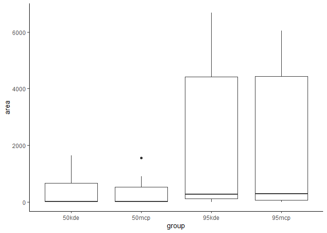
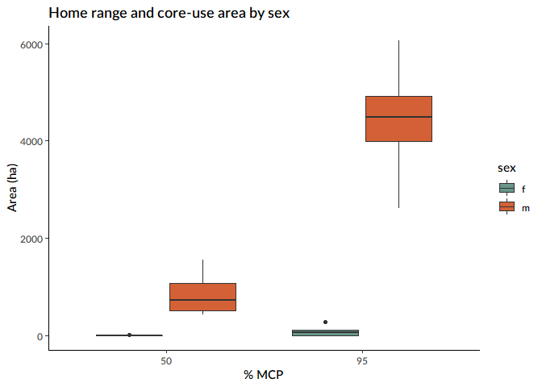

Telemetry refresher
================

Wow so I haven’t looked at any telemetry anything since April. And now I
am supposed to talk intelligently about it during my committee meeting.

``` r
# Import conflict settings.
source('../src/conflicted.R')
options(scipen=999)

#Load some libraries.
library(tidyverse)
library(sf)
library(lubridate)
library(adehabitatHR)
library(ggplot2)
library(extrafont)

# Define some colors.
m <- '#d36135' # Flame
f <- '#689689' # Polished pine

# Load telemetry data.
source('../src/clean_telemetry.R')

# Rename the data frame.
tl <- df
# tl <- read_csv('../data/processed/telemetry_2018-2019.csv')
```

Start with some summary information. Note that there was another female
tagged in 2019, UTZ, for which no data has been retrieved.

``` r
# How many tags?
tl %>% distinct(site, year(date), id, sex)
```

    ## # A tibble: 9 x 4
    ##   id    site  sex   `year(date)`
    ##   <chr> <chr> <chr>        <dbl>
    ## 1 HAR02 RLK   f             2020
    ## 2 HAR03 GRV   f             2020
    ## 3 HAR12 FMT   f             2020
    ## 4 HAR04 RLK   m             2019
    ## 5 HAR05 SKA   m             2019
    ## 6 HAR08 TCR   f             2019
    ## 7 HAR09 MTC   m             2019
    ## 8 HAR10 MTC   f             2019
    ## 9 HAR07 TCR   m             2018

``` r
# How much data per tag?
tl %>% group_by(id) %>%
  mutate(min=min(date), max=max(date), n.points=n(), period=max-min) %>% 
  distinct(id, site, n.points, min, max, period) 
```

    ## # A tibble: 9 x 6
    ## # Groups:   id [9]
    ##   id    site  min        max        n.points period  
    ##   <chr> <chr> <date>     <date>        <int> <drtn>  
    ## 1 HAR02 RLK   2020-06-13 2020-07-08     2932  25 days
    ## 2 HAR03 GRV   2020-06-08 2020-06-28     8891  20 days
    ## 3 HAR12 FMT   2020-06-25 2020-06-28      313   3 days
    ## 4 HAR04 RLK   2019-06-22 2019-07-08     1596  16 days
    ## 5 HAR05 SKA   2019-06-23 2019-09-04     4671  73 days
    ## 6 HAR08 TCR   2019-06-10 2019-06-27      135  17 days
    ## 7 HAR09 MTC   2019-05-02 2019-07-02     1225  61 days
    ## 8 HAR10 MTC   2019-05-02 2019-06-29      946  58 days
    ## 9 HAR07 TCR   2018-07-08 2018-12-15     2095 160 days

These points span some pretty different periods. To try to standardize
them, I can potentially chose just points within certain stages of the
breeding season.

``` r
# Define breeding season.
breeding.2018 <- interval(ymd(20180420), ymd(20180915))
breeding.2019 <- interval(ymd(20190420), ymd(20190915))
breeding.2020 <- interval(ymd(20200420), ymd(20200915))

# Select only points that fall within the breeding season.
tl.breeding <- tl %>% 
  filter(date %within% c(breeding.2018, breeding.2019, breeding.2020))

# Summarize.
tl.breeding %>% group_by(id) %>% 
  mutate(min=min(date), max=max(date), n.points=n(), period=max-min) %>% 
  distinct(id, site, n.points, min, max, period) %>% 
  arrange(site)
```

    ## # A tibble: 9 x 6
    ## # Groups:   id [9]
    ##   id    site  min        max        n.points period 
    ##   <chr> <chr> <date>     <date>        <int> <drtn> 
    ## 1 HAR12 FMT   2020-06-25 2020-06-28      104  3 days
    ## 2 HAR03 GRV   2020-06-08 2020-06-28     2964 20 days
    ## 3 HAR09 MTC   2019-05-02 2019-07-02      409 61 days
    ## 4 HAR10 MTC   2019-05-02 2019-06-29      315 58 days
    ## 5 HAR02 RLK   2020-06-13 2020-07-08      977 25 days
    ## 6 HAR04 RLK   2019-06-22 2019-07-08      532 16 days
    ## 7 HAR05 SKA   2019-06-23 2019-09-04     1557 73 days
    ## 8 HAR08 TCR   2019-06-10 2019-06-27       45 17 days
    ## 9 HAR07 TCR   2018-07-08 2018-09-14      637 68 days

These intervals combine what I previously called, separately, nestling
and fledgling. Since I previously calculated home ranges using those
separate categories, here I’ll calculate total breeding-season home
range.

``` r
# Transform telemetry data to a spatial format.
tl.breeding.sf <- tl.breeding %>% st_as_sf(coords=c('lon', 'lat')) %>%
  st_set_crs('+proj=longlat +ellps=WGS84 +datum=WGS84 +no_defs') %>%
  st_transform("+proj=utm +zone=10 +datum=WGS84 +units=m +no_defs")

# Make 95% & 50% MCPs
mcp <- tl.breeding.sf %>%
  #filter(id != 'HAR03') %>% 
  select(id, geometry) %>%
  as_Spatial() %>%
  mcp.area(percent=c(50, 95), unin='m', unout='ha', plotit=FALSE) %>% 
  rownames_to_column(var='percent') %>% 
  pivot_longer(-percent, names_to='id', values_to='area') %>% 
  mutate(method='mcp')

# Make 95% and 50% KDEs.
kde <- tl.breeding.sf %>%
  #filter(id != 'HAR03') %>% 
  select(id, geometry) %>%
  as_Spatial() %>%
  kernelUD() %>% 
  kernel.area(percent=c(50, 95), unin='m', unout='ha') %>% 
  rownames_to_column(var='percent') %>% 
  pivot_longer(-percent, names_to='id', values_to='area') %>% 
  mutate(method='kde')

# And in the darkness bind them.
homerange <- bind_rows(mcp, kde)

# Add sex info.
homerange <- tl %>% distinct(id, sex) %>% right_join(homerange, by=c('id'))
```

As a check of the methods, let’s see how the KDEs and MCPs compare at
different scales.

``` r
homerange %>% mutate(group=paste(percent, method, sep='')) %>% 
  ggplot(aes(x=group, y=area)) +
  geom_boxplot() +
  theme_classic()
```

<!-- -->

Visually, they look pretty similar. I think I’ll be going with the MCPs
even though they’re stupid because a) they’re more widely used and so
more comparable and b) the KDE has some issues with the smaller
homeranges.

More interestingly, let’s look at the difference between males and
females.

``` r
homerange %>% filter(method == 'mcp') %>%
  ggplot(aes(x=as.factor(percent), y=area, fill=sex)) +
  geom_boxplot() +
  labs(title='Home range and core-use area by sex', x='% MCP', y='Area (ha)') +
  scale_fill_manual(values=c(f, m)) +
  theme_classic() +
  theme(text=element_text(family="Lato Semibold"))
```

<!-- -->

Oh, yeah, huge difference. In table form:

``` r
homerange %>% filter(method == 'mcp') %>% 
  group_by(sex, percent) %>% 
  summarize(n=n(), mean.area=mean(area))
```

    ## # A tibble: 4 x 4
    ## # Groups:   sex [2]
    ##   sex   percent     n mean.area
    ##   <chr> <chr>   <int>     <dbl>
    ## 1 f     50          5      1.29
    ## 2 f     95          5     88.7 
    ## 3 m     50          4    852.  
    ## 4 m     95          4   4409.

Let’s also look at an overall average.

``` r
homerange %>% group_by(percent, method) %>% 
  summarize(mean.area=mean(area))
```

    ## # A tibble: 4 x 3
    ## # Groups:   percent [2]
    ##   percent method mean.area
    ##   <chr>   <chr>      <dbl>
    ## 1 50      kde         425.
    ## 2 50      mcp         379.
    ## 3 95      kde        2212.
    ## 4 95      mcp        2009.

I’m a bit suspicious about that graph above, with the KDEs, so let’s
look at the table form of that.

``` r
homerange %>% filter(method == 'kde') %>% 
  group_by(sex, percent) %>% 
  summarize(n=n(), mean.area=mean(area))
```

    ## # A tibble: 4 x 4
    ## # Groups:   sex [2]
    ##   sex   percent     n mean.area
    ##   <chr> <chr>   <int>     <dbl>
    ## 1 f     50          5      6.91
    ## 2 f     95          5    107.  
    ## 3 m     50          4    948.  
    ## 4 m     95          4   4845.

Ah… that seems problematic. What’s going on here? How about the females?

``` r
homerange %>% filter(sex == 'f' & percent == 50)
```

    ## # A tibble: 10 x 5
    ##    id    sex   percent    area method
    ##    <chr> <chr> <chr>     <dbl> <chr> 
    ##  1 HAR02 f     50       5.44   mcp   
    ##  2 HAR02 f     50      12.7    kde   
    ##  3 HAR03 f     50       0      mcp   
    ##  4 HAR03 f     50       0      kde   
    ##  5 HAR12 f     50       0.683  mcp   
    ##  6 HAR12 f     50      13.0    kde   
    ##  7 HAR08 f     50       0      mcp   
    ##  8 HAR08 f     50       0.0343 kde   
    ##  9 HAR10 f     50       0.345  mcp   
    ## 10 HAR10 f     50       8.72   kde

So HAR03 and HAR08 have 50% MCPs of 0 ha because they spend more than
50% of their time just sitting on the nest… I just did the math on HAR03
and she spend almost 96% of her time on the nest, which explains why she
also has a 95% MCP of 0.

HAR08 has only 84% of her points at the nest, so apparently that’s
enough to calculate a proper MCP. This concentration of points at the
nest is presumably why the KDE for HAR03 is broken. I think I’ll just
have to strip her from the analysis.

``` r
homerange %>% filter(sex == 'f' & percent == 95)
```

    ## # A tibble: 10 x 5
    ##    id    sex   percent    area method
    ##    <chr> <chr> <chr>     <dbl> <chr> 
    ##  1 HAR02 f     95      281.    mcp   
    ##  2 HAR02 f     95      267.    kde   
    ##  3 HAR03 f     95        0     mcp   
    ##  4 HAR03 f     95        0     kde   
    ##  5 HAR12 f     95      104.    mcp   
    ##  6 HAR12 f     95      152.    kde   
    ##  7 HAR08 f     95        0.192 mcp   
    ##  8 HAR08 f     95        0.397 kde   
    ##  9 HAR10 f     95       58.9   mcp   
    ## 10 HAR10 f     95      113.    kde

That seems to have fixed things.
